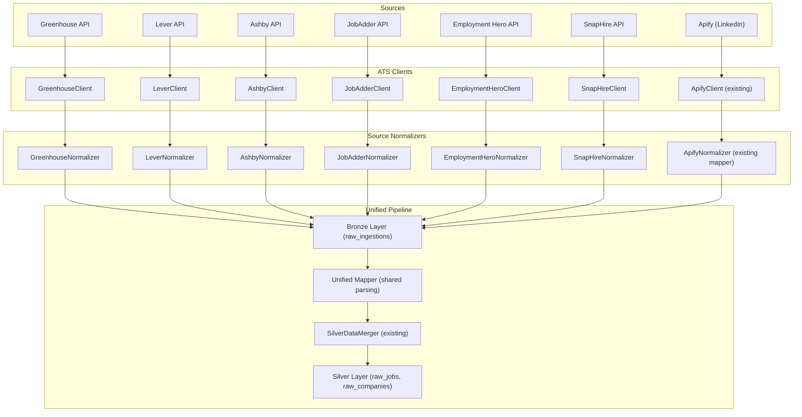
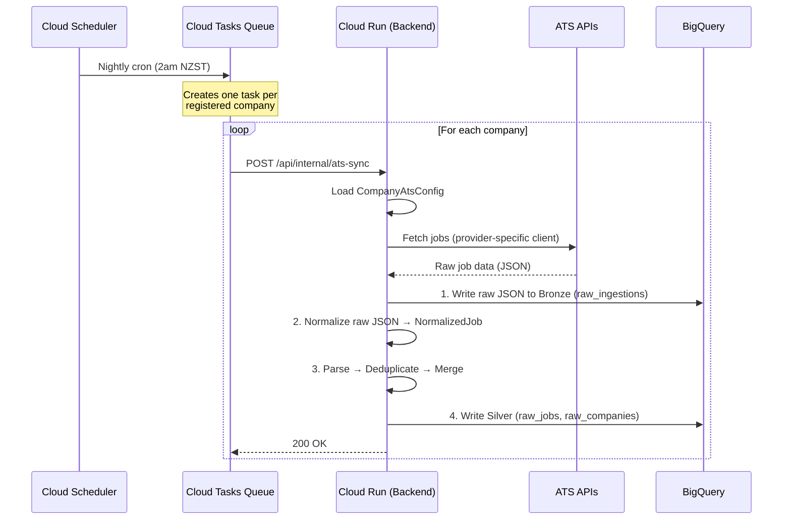

# ATS Integration — Multi-Source Job Data Pipeline

This document proposes a strategy for integrating with 6 major Applicant Tracking System (ATS) providers — **Greenhouse**, **Lever**, **Ashby**, **JobAdder**, **Employment Hero**, and **SnapHire** — while retaining **Apify** as a supplementary catch-all source. The goal is to pull job data from each provider's API, resolve their differing data shapes into our unified `JobRecord` and `CompanyRecord` entities, and run the whole thing on a weekly polling schedule.

---

## 1. Why ATS-Direct Integration?

Our current pipeline scrapes data via Apify (LinkedIn). This works, but has limitations:

| Limitation | ATS-Direct Advantage |
|:---|:---|
| Scraping is fragile and rate-limited | ATS APIs are official, stable, and designed for consumption |
| LinkedIn data lacks salary detail | Many ATS APIs expose structured salary, department, and compensation fields |
| We're dependent on a single source | Multi-source gives us resilience and broader coverage |
| Data freshness depends on Apify crawl cycles | We can poll ATS APIs on our own schedule |

**Apify remains valuable** as a catch-all for companies that don't use any of the 6 ATS providers (e.g. companies posting directly to LinkedIn, or using smaller/proprietary systems). The architecture below treats it as a 7th source, not a replacement.

---

## 2. ATS Provider API Overview

### 2.1 Greenhouse (Public Job Board API)

| Aspect | Detail |
|:---|:---|
| **Endpoint** | `GET https://boards-api.greenhouse.io/v1/boards/{board_token}/jobs` |
| **Single Job** | `GET https://boards-api.greenhouse.io/v1/boards/{board_token}/jobs/{job_id}` |
| **Auth** | ❌ None required (public data) |
| **Rate Limits** | Reasonable — standard HTTP polling is fine |
| **Format** | JSON |
| **Key Fields** | `id`, `title`, `location.name`, `content` (HTML), `departments[].name`, `offices[].name`, `updated_at`, `absolute_url` |
| **Compensation** | Not exposed in public API |
| **Pagination** | Query param `?content=true` to include body; all jobs returned in one response |

**Notes:** Greenhouse is extremely simple — a public board token is all we need. Each registered company provides their board token, and we fetch all jobs in a single call. No OAuth, no secrets.

---

### 2.2 Lever (Postings API v0)

| Aspect | Detail |
|:---|:---|
| **Endpoint** | `GET https://api.lever.co/v0/postings/{company_slug}` |
| **Single Job** | `GET https://api.lever.co/v0/postings/{company_slug}/{posting_id}` |
| **Auth** | ❌ None required for public postings |
| **Rate Limits** | Standard |
| **Format** | JSON (also supports HTML / iframe — we use JSON) |
| **Key Fields** | `id`, `text` (title), `categories.location`, `categories.department`, `categories.team`, `categories.commitment` (employment type), `description`, `descriptionPlain`, `lists[]` (structured sections), `hostedUrl`, `applyUrl`, `createdAt`, `workplaceType` |
| **Compensation** | `salaryRange` object with `min`, `max`, `currency`, `interval` |
| **Pagination** | `skip` and `limit` params (default limit 100) |

**Notes:** Lever's public v0 API is almost as simple as Greenhouse. The `categories` object is particularly useful — it gives us structured department, team, location, and employment type data. Salary data is available when the company chooses to publish it.

---

### 2.3 Ashby (Posting API)

| Aspect | Detail |
|:---|:---|
| **Endpoint** | `GET https://api.ashbyhq.com/posting-api/job-board/{company_slug}` |
| **Auth** | ❌ None required for public job board |
| **Rate Limits** | Standard |
| **Format** | JSON |
| **Key Fields** | `jobs[].id`, `jobs[].title`, `jobs[].location`, `jobs[].department`, `jobs[].employmentType`, `jobs[].descriptionHtml`, `jobs[].publishedAt`, `jobs[].jobUrl`, `jobs[].applyUrl` |
| **Compensation** | Available via `?includeCompensation=true` query param — returns `compensationTierSummary` with pay range |
| **Pagination** | All jobs returned in a single response |

**Notes:** Ashby returns everything in one call. The `?includeCompensation=true` flag is an opt-in that gives us a compensation summary string — we'll need to parse this into min/max values.

---

### 2.4 JobAdder (REST API v2)

| Aspect | Detail |
|:---|:---|
| **Endpoint** | `GET https://api.jobadder.com/v2/jobboards/{board_id}/ads` |
| **Board Discovery** | `GET https://api.jobadder.com/v2/jobboards` (lists available boards) |
| **Auth** | ✅ **OAuth 2.0** — Authorization Code flow with refresh tokens |
| **Token Lifetime** | Access token: 60 minutes; Refresh token: 14 days (inactivity expiry) |
| **Format** | JSON |
| **Key Fields** | `adId`, `title`, `description`, `location`, `salary`, `jobType`, `workType`, `category`, `subCategory`, `bulletPoints[]`, `portal.url` |
| **Compensation** | Structured salary object |
| **Pagination** | Offset-based |

**Notes:** JobAdder is the first provider requiring OAuth. We'll need to store client credentials per company, handle the authorization code flow once during onboarding, and keep refresh tokens alive. We have to register as a Partner application via `api@jobadder.com` to get API access.

> [!IMPORTANT]
> JobAdder requires proactive token refresh — the refresh token expires after **14 days of inactivity**. Our weekly poll keeps it alive, but we should build a safety margin (e.g. refresh at 10-day intervals as a background task).

---

### 2.5 Employment Hero (Careers Page API)

| Aspect | Detail |
|:---|:---|
| **Endpoint** | `GET https://api.employmenthero.com/api/v1/organisations/{org_id}/jobs` |
| **Auth** | ✅ **API Key** or **OAuth 2.0** (depending on tier) |
| **Token Lifetime** | Access token: 15 minutes (if using OAuth) |
| **Format** | JSON |
| **Key Fields** | `title`, `department`, `industry`, `remote`, `country_code`, `country_name`, `city`, `employment_type_name`, `employment_term_name`, `experience_level_name`, `description`, `created_at`, `application_url`, `recruitment_logo` |
| **Compensation** | `salary_currency`, `salary_minimum`, `salary_maximum`, `salary_rate_name` |
| **Pagination** | Standard offset/limit |

**Notes:** Employment Hero has excellent structured data — salary comes pre-parsed with currency and rate (hourly/annual). The Careers Page API may use simpler API key auth, while the full API requires OAuth. Platinum subscription or higher is required for API access — our registered companies need to be on that tier.

> [!WARNING]
> Employment Hero requires a **Platinum subscription** for API access. We should surface this requirement clearly during company onboarding so we know upfront which companies can actually integrate.

---

### 2.6 SnapHire (Talent App Store API)

| Aspect | Detail |
|:---|:---|
| **Endpoint** | Via Talent App Store (TAS) — custom app integration |
| **Auth** | ✅ **HMAC-based API key** (issued via TAS developer portal) |
| **Format** | JSON |
| **Key Fields** | Job title, description, location, employment type, status |
| **Compensation** | Varies — may not be consistently available |
| **Pagination** | Unknown — likely standard |

**Notes:** SnapHire is the most opaque of the six providers. It operates through a "Talent App Store" integration model, where we'd register as a TAS developer and build an app. The API surface is less documented publicly compared to the others. We may need to engage directly with SnapHire's developer relations team.

> [!CAUTION]
> SnapHire's API documentation is sparse. Before committing engineering effort, we should do a spike to register as a TAS developer and evaluate the actual API surface in practice. This provider carries the highest integration risk.

---

### 2.7 Apify (Supplementary — LinkedIn Scraper)

| Aspect | Detail |
|:---|:---|
| **Endpoint** | `GET https://api.apify.com/v2/datasets/{dataset_id}/items` |
| **Auth** | ✅ API Key (already implemented) |
| **Format** | JSON |
| **Key Fields** | Already mapped — see existing `ApifyJobDto` |
| **Role** | **Catch-all** for companies not on Greenhouse, Lever, Ashby, JobAdder, Employment Hero, or SnapHire |

**Notes:** Apify stays as-is. It runs as a 7th source using the existing `ApifyClient` and `RawJobDataMapper`. When ATS data is available for a company, ATS is the primary source and Apify data supplements it (e.g. filling in fields the ATS API doesn't expose). When a company has no ATS integration, Apify is the sole source.

---

## 3. Unified Data Model — Field Mapping

Every ATS has a different shape. The table below shows how each provider's fields map to our existing `JobRecord` and `CompanyRecord` models.

### 3.1 JobRecord Mapping

| Our Field | Greenhouse | Lever | Ashby | JobAdder | Employment Hero | SnapHire | Apify (existing) |
|:---|:---|:---|:---|:---|:---|:---|:---|
| `jobId` | Generated slug | Generated slug | Generated slug | Generated slug | Generated slug | Generated slug | Generated slug |
| `platformJobIds` | `id` | `id` | `id` | `adId` | Job ID | Job ID | `id` |
| `title` | `title` | `text` | `title` | `title` | `title` | Title | `title` |
| `companyName` | From registration | From slug | From slug | From board metadata | From org metadata | From config | `companyName` |
| `description` | `content` (HTML) | `descriptionPlain` | `descriptionHtml` | `description` | `description` | Description | `descriptionText` |
| `city` | Parse `location.name` | Parse `categories.location` | Parse `location` | Parse `location` | `city` | Parse location | `location` (parsed) |
| `stateRegion` | Parse `location.name` | Parse `categories.location` | Parse `location` | Parse `location` | — (derive from city) | Parse location | `location` (parsed) |
| `country` | Parse `offices[].location` | Parse `categories.location` | Parse `location` | Parse `location` | `country_code` ✅ | Parse location | `location` (parsed) |
| `salaryMin` | — | `salaryRange.min` | Parse `compensationTierSummary` | `salary.min` | `salary_minimum` ✅ | — | `salaryInfo` (parsed) |
| `salaryMax` | — | `salaryRange.max` | Parse `compensationTierSummary` | `salary.max` | `salary_maximum` ✅ | — | `salaryInfo` (parsed) |
| `seniorityLevel` | Heuristic from title | Heuristic from title | Heuristic from title | Heuristic from title | `experience_level_name` ✅ | Heuristic from title | `seniorityLevel` |
| `employmentType` | — | `categories.commitment` | `employmentType` ✅ | `jobType` | `employment_type_name` ✅ | — | `employmentType` |
| `workModel` | Heuristic from location | `workplaceType` ✅ | Heuristic from location | `workType` | `remote` ✅ | Heuristic | Heuristic |
| `technologies` | Extract from `content` | Extract from description | Extract from description | Extract from description | Extract from description | Extract from description | Extract from description |
| `postedDate` | `updated_at` | `createdAt` | `publishedAt` | Posted date | `created_at` | Created at | `postedAt` |
| `applyUrls` | `absolute_url` | `applyUrl` | `applyUrl` | `portal.url` | `application_url` | Apply URL | `applyUrl` |
| `platformLinks` | `absolute_url` | `hostedUrl` | `jobUrl` | Portal URL | — | — | `link` |
| `source` | `"Greenhouse"` | `"Lever"` | `"Ashby"` | `"JobAdder"` | `"EmploymentHero"` | `"SnapHire"` | `"LinkedIn-Apify"` |
| `lastSeenAt` | Sync timestamp | Sync timestamp | Sync timestamp | Sync timestamp | Sync timestamp | Sync timestamp | Ingestion timestamp |

✅ = Natively structured (no heuristic/parsing needed)

### 3.2 CompanyRecord Mapping

| Our Field | Source |
|:---|:---|
| `companyId` | Generated from company name via `IdGenerator` |
| `name` | From company registration / ATS metadata |
| `logoUrl` | Greenhouse: not in public API; Lever: not in v0; Employment Hero: `recruitment_logo`; Others: from registration |
| `website` | From registration data (most ATS APIs don't expose this) |
| `industries` | Lever: `categories.department`; JobAdder: `category`; Others: from registration |
| `technologies` | Aggregated from all `JobRecord.technologies` for this company |
| `hiringLocations` | Aggregated from all `JobRecord` locations for this company |
| `lastUpdatedAt` | Latest sync timestamp |

---

## 4. Architecture — Multi-Source Pipeline

### 4.1 Extending the Medallion Architecture

The existing Bronze → Silver → Gold pipeline extends naturally. Each ATS becomes a new source feeding into Bronze, and a new set of provider-specific mappers normalize data before it enters Silver.



### 4.2 Key Design Decisions

#### A. Source Normalizer Pattern (Strategy)

Each ATS gets a **Client** (HTTP communication) and a **Normalizer** (data shape translation). The normalizer converts provider-specific DTOs into a common intermediate format (`NormalizedJob`) that our shared parsing logic (`RawJobDataParser`) can process.

```
interface AtsNormalizer {
    fun normalize(rawData: JsonNode): List<NormalizedJob>
}

data class NormalizedJob(
    val platformId: String,
    val source: String,               // "Greenhouse", "Lever", etc.
    val title: String?,
    val companyName: String,
    val location: String?,            // Raw location string for RawJobDataParser
    val descriptionHtml: String?,
    val descriptionText: String?,
    val salaryMin: Int?,              // Pre-parsed if structured
    val salaryMax: Int?,
    val salaryCurrency: String?,
    val employmentType: String?,
    val seniorityLevel: String?,      // Pre-parsed if available
    val workModel: String?,           // Pre-parsed if available (e.g., Lever workplaceType)
    val department: String?,
    val postedAt: String?,
    val applyUrl: String?,
    val platformUrl: String?,
    val rawPayload: String            // Original JSON for Bronze layer audit
)
```

This means:
- **Structured fields** (e.g. Employment Hero's `salary_minimum`) are mapped directly — no heuristic needed.
- **Unstructured fields** (e.g. Greenhouse's `location.name`) are left as raw strings for `RawJobDataParser` to handle, reusing existing parsing logic.
- The `rawPayload` is stored in Bronze regardless, preserving the full audit trail.

#### B. Source Priority & Conflict Resolution

When the same company has data from both an ATS and Apify, we need a merge strategy:

| Scenario | Resolution |
|:---|:---|
| Same job exists in ATS + Apify | **ATS wins** — structured data is more reliable. Apify data can supplement missing fields (e.g. if ATS lacks salary but Apify has it). |
| Job only in ATS | Use ATS data directly |
| Job only in Apify | Use Apify data directly (company has no ATS integration) |
| Company metadata conflicts | ATS is primary; Apify supplements `alternateNames` |

This resolution builds on the existing `SilverDataMerger` — we add a `sourcePriority` concept where ATS sources rank higher than scraped sources.

#### C. Cross-Source Deduplication

Jobs from different sources for the same company need deduplication. Our existing `(company, country, title)` key works, but we should add:

1. **Platform-ID cross-reference table** — maps `(source, platformId)` → `jobId` so we can detect when Apify and an ATS are reporting the same job.
2. **Fuzzy title matching** — catch cases where titles differ slightly across platforms (e.g. "Senior Software Engineer" vs "Sr. Software Engineer").
3. **Temporal proximity** — two postings with the same title within 7 days are likely the same opening.

---

## 5. Company Registration & Configuration

For ATS integration, we need to know which companies use which provider, and their credentials/identifiers.

### 5.1 Company ATS Configuration

```
data class CompanyAtsConfig(
    val companyId: String,
    val atsProvider: AtsProvider,           // GREENHOUSE, LEVER, ASHBY, etc.
    val identifier: String,                // Board token, slug, org ID, etc.
    val credentials: AtsCredentials?,      // Only for OAuth-based providers
    val enabled: Boolean,
    val lastSyncedAt: Instant?,
    val syncStatus: SyncStatus             // SUCCESS, FAILED, PENDING
)

enum class AtsProvider {
    GREENHOUSE,     // identifier = board token
    LEVER,          // identifier = company slug
    ASHBY,          // identifier = company slug
    JOBADDER,       // identifier = board ID (discovered via API)
    EMPLOYMENT_HERO,// identifier = organisation ID
    SNAPHIRE,       // identifier = TAS app ID
    APIFY           // identifier = n/a (catch-all)
}
```

### 5.2 Credentials Storage

| Provider | What We Store | Storage |
|:---|:---|:---|
| Greenhouse | Board token (public) | Plain config |
| Lever | Company slug (public) | Plain config |
| Ashby | Company slug (public) | Plain config |
| JobAdder | Client ID, Client Secret, Refresh Token | **GCP Secret Manager** |
| Employment Hero | API Key or OAuth tokens | **GCP Secret Manager** |
| SnapHire | HMAC API Key | **GCP Secret Manager** |
| Apify | API Key (shared, not per-company) | Environment variable (existing) |

> [!IMPORTANT]
> OAuth tokens and API keys must **never** be stored in BigQuery or application config. Use GCP Secret Manager with IAM-scoped access from the Cloud Run service account.

---

## 6. Scheduled Polling System

### 6.1 Architecture

Given our Cloud Run deployment and "$0/month" cost goal (from `background-processing.md`), the best approach is **Cloud Scheduler → Cloud Tasks → Cloud Run**.



> [!IMPORTANT]
> **Bronze-first ingestion**: Raw JSON from the ATS is stored in Bronze **before** any normalization. This mirrors our existing `JobDataSyncService` pattern and means we can safely change normalization logic in the future and reprocess all historical data from the immutable Bronze source.

### 6.2 Why Cloud Scheduler + Cloud Tasks?

| Consideration | Cloud Scheduler + Tasks | Spring `@Scheduled` | Cloud Run Jobs |
|:---|:---|:---|:---|
| **Works on Cloud Run** | ✅ Yes (HTTP-triggered) | ❌ CPU throttled after response | ✅ Yes |
| **Per-company retries** | ✅ Individual task retries | ❌ All-or-nothing | ⚠️ Manual |
| **Cost** | $0 (see [Section 9](#9-cost-estimate) for breakdown) | $0 (but unreliable) | Free tier |
| **Isolation** | ✅ Each company is an independent task | ❌ Coupled | ✅ Separate executions |
| **Timeout** | Up to 30 min per task | N/A | Up to 24 hours |

### 6.3 Sync Flow Detail

```kotlin
// Triggered by Cloud Tasks for a single company
@PostMapping("/api/internal/ats-sync")
fun syncCompanyData(@RequestBody request: AtsSyncRequest) {
    val config = configRepository.getAtsConfig(request.companyId)
    
    val client = atsClientFactory.getClient(config.atsProvider)
    val normalizer = atsNormalizerFactory.getNormalizer(config.atsProvider)
    
    // 1. Fetch raw data from ATS
    val rawResponse = client.fetchJobs(config.identifier, config.credentials)
    
    // 2. Store raw JSON in Bronze layer FIRST (immutable audit trail)
    //    This preserves the original payload so we can re-normalize later
    //    if our parsing logic changes — just like our existing Apify pipeline.
    bronzeIngester.ingestRaw(rawResponse, config.atsProvider, config.companyId)
    
    // 3. Normalize raw JSON to common format
    val normalizedJobs = normalizer.normalize(rawResponse)
    
    // 4. Parse, deduplicate, merge into Silver layer
    //    Reuses existing RawJobDataParser + SilverDataMerger
    val mapped = unifiedMapper.map(normalizedJobs)
    silverMerger.mergeAndPersist(mapped)
    
    // 5. Update sync status
    configRepository.updateSyncStatus(request.companyId, SyncStatus.SUCCESS)
}
```

> [!NOTE]
> **Why Bronze before normalization?** If we change how we normalize content in the future (e.g., improve location parsing, add new field extraction), we can replay the original raw JSON through updated normalizers — exactly as `reprocessHistoricalData()` works today for Apify data. The Bronze layer is our insurance policy.

### 6.4 Schedule Configuration

| Parameter | Value | Reasoning |
|:---|:---|:---|
| **Frequency** | **Nightly** (2:00 AM NZST) | Near-daily freshness makes us significantly more competitive. Cost is still $0 (see Section 9). |
| **Task dispatch rate** | 5 tasks/second | Avoids overwhelming ATS APIs with concurrent requests |
| **Retry policy** | 3 retries with exponential backoff (10s, 60s, 300s) | Handles transient API failures |
| **Task timeout** | 5 minutes per company | More than enough for even large job boards |
| **Apify sync** | Separate schedule (existing webhook + nightly fallback) | Keeps existing flow; adds a nightly poll as a safety net |

### 6.5 Failure Handling

| Failure Type | Handling |
|:---|:---|
| API temporarily down | Cloud Tasks retries (3x with backoff) |
| OAuth token expired | Refresh token automatically before request; if refresh fails, mark company as `AUTH_EXPIRED` and alert |
| Invalid/revoked credentials | Mark `SyncStatus.AUTH_FAILED`; skip until reconfigured |
| Partial data (rate limited) | Store what we got; next sync fills the gaps via `SilverDataMerger` |
| Schema change in ATS API | Normalizer handles gracefully with null defaults; log warnings for unrecognized fields |

---

## 7. Implementation Phases

Tasks are tagged with who does the work:
- 🤖 **Code** — engineering work (Antigravity builds this)
- 👤 **You** — manual research, configuration, or external outreach you'll need to do

### Phase 1 — Foundation (Highest Value, Lowest Effort)

**Scope:** Greenhouse + Lever + Ashby (all public, no-auth APIs)

**👤 Your tasks:**
- [ ] 👤 **Research company ATS identifiers** — for each company we track, determine which ATS they use and find their board token / company slug. This is typically visible in the URL of their careers page:
  - Greenhouse: `boards.greenhouse.io/{board_token}` → the `board_token`
  - Lever: `jobs.lever.co/{company_slug}` → the `company_slug`
  - Ashby: `jobs.ashbyhq.com/{company_slug}` → the `company_slug`
- [ ] 👤 **Build initial company roster** — create a spreadsheet or JSON file mapping each company to their ATS provider and identifier. This becomes the seed data for `CompanyAtsConfig`.
- [ ] 👤 **Validate test companies** — pick 2–3 companies per ATS provider that we can use for development and testing (ideally companies with a mix of job volumes).

**🤖 Code tasks:**
- [ ] 🤖 Define `NormalizedJob` intermediate model
- [ ] 🤖 Create `AtsNormalizer` interface and implement for Greenhouse, Lever, Ashby
- [ ] 🤖 Create `GreenhouseClient`, `LeverClient`, `AshbyClient` HTTP clients
- [ ] 🤖 Create `CompanyAtsConfig` model and `AtsConfigRepository` (BigQuery table)
- [ ] 🤖 Build seed data loader to import your company roster into `CompanyAtsConfig`
- [ ] 🤖 Extend `raw_ingestions` Bronze table to include `source` field
- [ ] 🤖 Build `UnifiedJobDataMapper` that accepts `NormalizedJob` and reuses `RawJobDataParser`
- [ ] 🤖 Extend `SilverDataMerger` with source priority logic
- [ ] 🤖 Add `POST /api/internal/ats-sync` endpoint
- [ ] 🤖 Update `source` field on existing `JobRecord` to distinguish ATS vs Apify data
- [ ] 🤖 Manual testing with the test companies you identified

### Phase 2 — Scheduling & OAuth Providers

**Scope:** Cloud Scheduler/Tasks setup + JobAdder + Employment Hero

**👤 Your tasks:**
- [ ] 👤 **Register as a JobAdder API Partner** — email `api@jobadder.com` to request partner access. They'll issue client credentials after review.
- [ ] 👤 **Confirm Employment Hero tier** — for each company using Employment Hero, verify they have a Platinum subscription (required for API access). If not, flag them as Apify-only.
- [ ] 👤 **Authorize OAuth for each JobAdder/EH company** — once we build the OAuth callback flow, you'll send each company a one-time authorization link. They click it, approve access, and we store the token.
- [ ] 👤 **Set up GCP Cloud Scheduler** — create the cron job in GCP Console (or we can script this via Terraform/gcloud CLI).
- [ ] 👤 **Set up Cloud Tasks queue** — create a task queue in GCP Console with the retry policy from Section 6.4.

**🤖 Code tasks:**
- [ ] 🤖 Create `CloudTasksDispatcher` service
- [ ] 🤖 Implement `JobAdderClient` with OAuth 2.0 flow (authorization code + refresh)
- [ ] 🤖 Implement `EmploymentHeroClient` with API key / OAuth
- [ ] 🤖 Set up GCP Secret Manager integration for credential storage
- [ ] 🤖 Build OAuth callback endpoint (`/api/auth/callback/{provider}`) for company onboarding
- [ ] 🤖 Add token refresh scheduling (pre-emptive refresh before expiry)
- [ ] 🤖 Add `SyncStatus` tracking and alerting on failures

### Phase 3 — SnapHire & Advanced Features

**Scope:** SnapHire integration + cross-source deduplication + monitoring

**👤 Your tasks:**
- [ ] 👤 **Register as a SnapHire TAS developer** — sign up at the Talent App Store developer portal. Evaluate the API surface and report back on feasibility.
- [ ] 👤 **Identify SnapHire companies** — determine which of our tracked companies use SnapHire and obtain their TAS identifiers.
- [ ] 👤 **Review deduplication quality** — after cross-source dedup is implemented, spot-check 20–30 jobs to verify duplicates are correctly merged and no valid jobs are lost.

**🤖 Code tasks:**
- [ ] 🤖 Implement `SnapHireClient` and `SnapHireNormalizer`
- [ ] 🤖 Build cross-source deduplication logic (platform ID cross-reference table)
- [ ] 🤖 Add fuzzy title matching for cross-source dedup
- [ ] 🤖 Build `/api/admin/sync-status` dashboard endpoint
- [ ] 🤖 Add data quality metrics (missing fields, parse failures per source)
- [ ] 🤖 Implement Apify as supplementary source with ATS-first priority merge

### Phase 4 — Polish & Gold Layer Integration

**Scope:** Connect ATS data to Gold layer aggregation

**👤 Your tasks:**
- [ ] 👤 **Onboard remaining companies** — work through the full company roster to ensure all companies with ATS integrations are registered and syncing.
- [ ] 👤 **Write onboarding documentation** — create runbooks for how to add a new company (finding their ATS, getting credentials, running first sync).

**🤖 Code tasks:**
- [ ] 🤖 Feed multi-source Silver data into Gold layer trend tables (from `data-pipeline.md`)
- [ ] 🤖 Add `source` dimension to Gold aggregations (trends by source)
- [ ] 🤖 Salary normalization across currencies/rates (from data-pipeline roadmap)
- [ ] 🤖 Add per-source data quality scoring to admin dashboard
- [ ] 🤖 Build `reprocessFromBronze()` support for ATS sources (reprocess raw ATS data through updated normalizers)

---

## 8. New Files & Components Summary

| Component | Path | Purpose |
|:---|:---|:---|
| `AtsNormalizer` | `sync/ats/AtsNormalizer.kt` | Interface for source-specific data normalization |
| `NormalizedJob` | `sync/ats/model/NormalizedJob.kt` | Common intermediate DTO |
| `GreenhouseClient` | `sync/ats/greenhouse/GreenhouseClient.kt` | HTTP client for Greenhouse API |
| `GreenhouseNormalizer` | `sync/ats/greenhouse/GreenhouseNormalizer.kt` | Greenhouse → NormalizedJob |
| `LeverClient` | `sync/ats/lever/LeverClient.kt` | HTTP client for Lever API |
| `LeverNormalizer` | `sync/ats/lever/LeverNormalizer.kt` | Lever → NormalizedJob |
| `AshbyClient` | `sync/ats/ashby/AshbyClient.kt` | HTTP client for Ashby API |
| `AshbyNormalizer` | `sync/ats/ashby/AshbyNormalizer.kt` | Ashby → NormalizedJob |
| `JobAdderClient` | `sync/ats/jobadder/JobAdderClient.kt` | OAuth HTTP client for JobAdder |
| `JobAdderNormalizer` | `sync/ats/jobadder/JobAdderNormalizer.kt` | JobAdder → NormalizedJob |
| `EmploymentHeroClient` | `sync/ats/employmenthero/EmploymentHeroClient.kt` | HTTP client for Employment Hero |
| `EmploymentHeroNormalizer` | `sync/ats/employmenthero/EmploymentHeroNormalizer.kt` | Employment Hero → NormalizedJob |
| `SnapHireClient` | `sync/ats/snaphire/SnapHireClient.kt` | HTTP client for SnapHire TAS |
| `SnapHireNormalizer` | `sync/ats/snaphire/SnapHireNormalizer.kt` | SnapHire → NormalizedJob |
| `AtsClientFactory` | `sync/ats/AtsClientFactory.kt` | Factory to get the right client by provider |
| `AtsNormalizerFactory` | `sync/ats/AtsNormalizerFactory.kt` | Factory to get the right normalizer by provider |
| `UnifiedJobDataMapper` | `sync/UnifiedJobDataMapper.kt` | Maps NormalizedJob → JobRecord/CompanyRecord (reuses `RawJobDataParser`) |
| `CompanyAtsConfig` | `persistence/model/CompanyAtsConfig.kt` | Per-company ATS configuration model |
| `AtsConfigRepository` | `persistence/ats/AtsConfigRepository.kt` | BigQuery persistence for ATS configs |
| `CloudTasksDispatcher` | `sync/scheduling/CloudTasksDispatcher.kt` | Creates Cloud Tasks for each company |
| `AtsSyncController` | `controller/AtsSyncController.kt` | Internal endpoint for Cloud Tasks callbacks |
| `OAuthTokenManager` | `sync/ats/auth/OAuthTokenManager.kt` | Token refresh and secure storage via Secret Manager |

---

## 9. Cost Estimate

### 9.1 How Cloud Scheduler + Tasks Pricing Works

**Cloud Scheduler** charges per *job definition* (i.e., per cron schedule you configure), not per execution:
- **Free tier:** 3 job definitions per billing account per month
- **Beyond free tier:** $0.10 per job per month
- We'd need **1 job** (a single nightly cron). This is well within the free tier — we could run it every minute and it wouldn't cost more, because you pay for the job's existence, not how often it fires.

**Cloud Tasks** charges per *billable operation* (API calls + push delivery attempts), chunked at 32KB:
- **Free tier:** 1,000,000 operations per month
- **Beyond free tier:** $0.40 per million operations

### 9.2 Nightly Sync Cost Breakdown

Assuming **100 registered companies** (a generous upper estimate for early stages):

| Operation | Count per night | Monthly (×30) | Notes |
|:---|:---|:---|:---|
| Cloud Scheduler fires cron | 1 | 30 | Triggers the dispatch endpoint |
| Cloud Tasks created (1 per company) | 100 | 3,000 | Each task is a single API call (~1KB, well under 32KB chunk) |
| Cloud Tasks push delivery | 100 | 3,000 | Each task calls our Cloud Run endpoint once |
| Retry deliveries (est. 5% failure rate) | ~15 | ~450 | 3 retries × 5 failed tasks |
| **Total task operations** | **~216** | **~6,480** | Well under the 1M free tier |

| Resource | Monthly Cost (Nightly, 100 companies) | Monthly Cost (Weekly, 100 companies) |
|:---|:---|:---|
| Cloud Scheduler | **$0** (1 job, free tier covers 3) | **$0** |
| Cloud Tasks | **$0** (~6,480 ops, free tier covers 1M) | **$0** (~1,620 ops) |
| Cloud Run invocations | **$0** (~3,000 requests, free tier covers 2M) | **$0** (~750 requests) |
| GCP Secret Manager | **~$0.06** ($0.06/10K accesses) | **~$0.02** |
| BigQuery storage (incremental) | **~$0.50** | **~$0.50** |
| **Total** | **< $1/month** ✅ | **< $1/month** ✅ |

> [!TIP]
> **Nightly syncs are essentially free.** Even at 100 companies synced every night, we'd use ~6,500 of our 1,000,000 free Cloud Tasks operations (~0.65%). We could scale to **15,000+ companies nightly** before hitting the paid tier. There is no cost reason to limit ourselves to weekly syncs — **nightly gives us a major competitive advantage at zero additional cost.**

---

## 10. Risks & Reliability Considerations

Building a multi-source pipeline that aims to be **the most reliable source of tech job information** introduces several categories of risk. Below is a comprehensive breakdown and the mitigations we should build in.

### 10.1 API Stability & Breaking Changes

| Risk | Impact | Mitigation |
|:---|:---|:---|
| ATS provider deprecates or versions their API | Normalizer breaks silently; stale/missing data | **Schema validation** — each normalizer should validate incoming JSON against an expected shape and emit structured warnings when unknown fields appear or expected fields vanish. This gives us early warning before data quality degrades. |
| Rate limit changes | Sync fails mid-way; partial data ingested | **Adaptive rate limiting** — track `429` / `Retry-After` headers per provider and dynamically throttle. Store rate limit metadata in `CompanyAtsConfig` so subsequent syncs respect provider-specific limits. |
| API outage during sync window | No data for that week | **Staggered retries** — Cloud Tasks already retries 3x, but we should also support a **secondary sync window** (e.g., Tuesday 2am if Sunday sync failed) so companies don't go 2 weeks without fresh data. |

### 10.2 OAuth Token Fragility

| Risk | Impact | Mitigation |
|:---|:---|:---|
| Refresh token expires (JobAdder: 14-day inactivity) | Silent auth failure; company data goes stale | **Pre-emptive token refresh** — schedule a Cloud Tasks job mid-week (e.g., Wednesday) that refreshes all OAuth tokens. This ensures the token is never more than 4 days from its last use, well within the 14-day window. |
| Company revokes OAuth access | Sync fails with 401 | **Auth health monitoring** — after each sync, verify token validity. On `401`, immediately mark the company as `AUTH_REVOKED` and trigger an alert (email / Slack webhook) so we can follow up. |
| Token stored insecurely | Credential leak; security incident | **Never store tokens in BigQuery or config files.** Use GCP Secret Manager with IAM-scoped access. Rotate service account keys periodically. |

### 10.3 Data Quality & Consistency

| Risk | Impact | Mitigation |
|:---|:---|:---|
| ATS returns garbage data (empty titles, placeholder descriptions) | Pollutes Silver layer; degrades user trust | **Pre-Silver validation gate** — before merging into Silver, every `NormalizedJob` must pass a minimum quality threshold: non-empty title, non-empty company name, valid location or "Unknown". Reject records that fail, log them for review. |
| Different sources report conflicting data for the same job | Users see duplicate or contradictory listings | **Source-priority merge with conflict logging** — ATS always wins over Apify, but **log every conflict** to a `data_conflicts` audit table. This lets us measure how often sources disagree and tune our merge strategy over time. |
| Salary data in different currencies/ranges | Misleading salary comparisons across countries | **Normalize salary to a standard unit** — store `salaryCurrency` and `salaryInterval` (annual/hourly/monthly) alongside min/max. Present salary in original currency but allow conversion using a static exchange rate table for cross-market comparisons. |
| Technology extraction misses new frameworks | Technology trends become stale | **Monthly tech keyword review** — periodically audit `RawJobDataParser.techKeywords` against descriptions that don't match any keywords. Flag descriptions with >500 words and zero tech matches for manual review. Consider crowdsourcing new keyword suggestions from users. |

### 10.4 Deduplication Failure Modes

| Risk | Impact | Mitigation |
|:---|:---|:---|
| Same job appears from ATS + Apify with slightly different titles | Duplicate listings in Silver | **Multi-signal matching** — combine `(company, country, normalizedTitle)` with temporal proximity (posted within 7 days) and location overlap. A match on 2 of 3 signals = likely duplicate. |
| Company name variations across sources (e.g., "XYZ Ltd" vs "XYZ Limited" vs "XYZ") | Same company stored as separate entities | **Company name canonicalization** — build a lookup table of known variations. Use `IdGenerator.slugify()` to strip suffixes like "Ltd", "Limited", "Inc", "Pty". Store all variants in `CompanyRecord.alternateNames`. |
| Re-posted job (closed and reopened) treated as same opening | Over-deduplication — we lose valid reopened positions | **Job lifecycle awareness** — if a job was previously marked `LIKELY_CLOSED` (>30 days since `lastSeenAt`) and reappears, treat it as a **new opening** with a fresh `jobId` date segment. |

### 10.5 Scheduling & Infrastructure

| Risk | Impact | Mitigation |
|:---|:---|:---|
| Cloud Scheduler cron fires but Cloud Run is cold-starting | Task times out before processing begins | **Set Cloud Run min-instances to 1** during the sync window (Sunday 1:50am–3:00am). Use Cloud Scheduler to warm the instance 10 minutes before the main sync cron. Revert to 0 after sync completes. |
| Too many companies → tasks overwhelm a single Cloud Run instance | Out-of-memory or CPU throttling | **Concurrency control** — set Cloud Tasks dispatch rate to 5/sec and Cloud Run max concurrency to 10. Each sync task is independent, so horizontal scaling handles load. |
| BigQuery write failures mid-sync | Partial Silver update; data inconsistency | **Atomic batch writes** — group all Silver writes for a company into a single BigQuery streaming insert or batch job. If any part fails, retry the entire company sync (not individual records). |

### 10.6 Security & Compliance

| Risk | Impact | Mitigation |
|:---|:---|:---|
| PII leaks through job descriptions | Privacy violation | **Reuse `PiiSanitizer`** — run all description text through the existing sanitizer before persisting to Silver. Extend it to catch additional PII patterns from ATS-specific fields (e.g., recruiter names, internal codes). |
| Scraping legality (Apify / LinkedIn) | Legal risk from ToS violation | **Minimize scraping reliance** — as ATS coverage grows, reduce Apify usage to only companies without ATS integrations. Document that ATS data is sourced from official APIs with company consent. |
| Credential exposure in logs | Security incident | **Structured logging with sensitive field masking** — ensure no OAuth tokens, API keys, or `rawPayload` contents appear in Cloud Run logs. Use log redaction filters. |

### 10.7 Vendor & Platform Risk

| Risk | Impact | Mitigation |
|:---|:---|:---|
| ATS provider changes pricing / restricts API access | Lose access to a data source | **Multi-provider strategy is itself a mitigation.** No single provider loss is catastrophic. Maintain Apify as a fallback for any provider that becomes unavailable. |
| GCP free tier changes | Costs increase beyond budget | **Architecture is portable** — Cloud Scheduler + Tasks can be replaced with a simple cron job + HTTP calls if needed. BigQuery could be swapped for PostgreSQL. Nothing in the design is deeply coupled to GCP-specific services. |
| Provider acquires/merges with another provider | API consolidation or discontinuation | **Monitor provider health** — track API changelog pages. Set up alerts for deprecation notices. The normalizer pattern means swapping one provider's implementation is isolated to 2 files (Client + Normalizer). |

---

## 11. Future Improvements & Strategic Suggestions

Beyond the core integration, here are ideas to make this pipeline a best-in-class competitive advantage.

### 11.1 Webhook Push (Instead of Polling)

Several ATS providers support **webhooks** that push data to us when jobs are created, updated, or closed:

- **Greenhouse**: Supports webhooks for `job_post.created`, `job_post.updated`, `job_post.deleted`
- **Lever**: Supports webhooks via v1 API
- **Ashby**: Supports webhooks for job lifecycle events

**Benefit:** Near-real-time data freshness instead of weekly polling. This could make us the fastest source of new job listings.

**Approach:** Keep weekly polling as a **safety net** (catches anything webhooks miss), but process webhooks as they arrive for immediate updates. This hybrid model gives us both speed and reliability.

### 11.2 Unified ATS Middleware (Merge / Knit / Kombo)

Services like [Merge.dev](https://merge.dev), [Knit](https://getknit.dev), and [Kombo](https://kombo.dev) provide a **single API** that aggregates 50+ ATS providers behind a unified schema. Instead of building 6+ individual integrations, we could:

1. Integrate with one middleware API
2. Get access to dozens of ATS providers immediately
3. Let the middleware handle OAuth, pagination, rate limiting, and schema changes

**Trade-off:** Adds a dependency and potential cost (most charge per connected account). But it dramatically reduces engineering effort and maintenance burden, especially as we scale beyond 6 providers.

**Recommendation:** Build the first 3 providers (Greenhouse, Lever, Ashby) ourselves to learn the domain. Evaluate middleware for providers 4+ if the per-provider maintenance cost is high.

### 11.3 LLM-Powered Data Enrichment

Use an LLM to extract structured information that heuristics struggle with:

| Enrichment | Current Approach | LLM Advantage |
|:---|:---|:---|
| Technology extraction | Regex keyword matching | Understands context — "experience with reactive frameworks" → RxJava, RxSwift, etc. |
| Seniority detection | Title keyword heuristic | Infers from description — "10+ years experience, leading a team of 5" → Senior/Lead |
| Job category classification | Not implemented | Classifies roles into standardized categories (Backend, Frontend, DevOps, Data, etc.) |
| Salary range estimation | Only available when structured | Infers from job description context or market data when not provided |
| Company culture signals | Not implemented | Extracts benefits, work-life balance indicators, diversity commitments from descriptions |

**Approach:** Run LLM enrichment as an **asynchronous post-processing step** after Silver layer ingestion. Store LLM-derived fields separately (e.g., `enriched_technologies`, `enriched_seniority`) so we can distinguish between structured source data and inferred data.

### 11.4 Company Self-Service Portal

Build a lightweight admin portal where companies can:

1. **Register their ATS** — select provider, enter board token/slug, and authorize OAuth
2. **View sync status** — see when their data was last synced, how many jobs were imported, and any errors
3. **Correct data** — flag incorrect mappings (e.g., wrong city, wrong technology association)
4. **Manage branding** — upload logos, descriptions, and website URLs (supplementing what the ATS API provides)

This shifts onboarding from a manual admin process to a scalable self-service flow.

### 11.5 Data Coverage Dashboard

Build an internal dashboard (or admin API) that tracks:

| Metric | Purpose |
|:---|:---|
| Jobs per source per week | Spot when a source is declining or a new source is outperforming |
| Field completeness rate per source | Know which providers give us the richest data (e.g., "Employment Hero fills 95% of salary fields, Greenhouse fills 0%") |
| Deduplication hit rate | Measure how many Apify jobs overlap with ATS data — helps decide when to reduce Apify reliance |
| Sync success/failure rate per provider | Early warning for API issues |
| Time-to-index (posting → available on our platform) | Benchmark our freshness vs. competitors |
| Stale job percentage | Track data hygiene — what % of our listed jobs are likely already filled? |

### 11.6 Competitive Moat Strategies

To become **the most reliable source**, consider:

1. **Data licensing partnerships** — approach ATS providers about premium/partner API access. Being a recognized integration partner gives us higher rate limits, early access to new fields, and listing in their marketplace (driving organic company sign-ups).
2. **Exclusive data sources** — integrate with niche job boards specific to NZ/AU tech (e.g., Seek API for ANZ, Indeed Publisher API) as additional Bronze sources. More sources = harder to replicate.
3. **Job expiry intelligence** — actively detect when jobs close (disappear from ATS) and mark them accordingly. Most job sites leave stale listings up. Having accurate "this job is still open" status would be a significant differentiator.
4. **Historical analytics** — because we persist everything in Bronze, we can offer unique time-series data: "average time to fill for Senior Engineers in Auckland", "salary trend for React developers in 2025 vs 2026". No ATS alone has this cross-company view.
5. **Open API for researchers/recruiters** — expose a public read-only API for aggregated market data. This creates network effects (people build tools on our data) and positions us as a data authority.

### 11.7 Incremental Architecture Improvements

| Improvement | Detail |
|:---|:---|
| **Circuit breaker per provider** | If a provider fails 3 consecutive syncs, automatically disable it and alert. Prevents wasted compute and noisy logs. Re-enable after manual review or after a health-check probe succeeds. |
| **Dead letter queue** | Failed sync tasks go to a DLQ instead of being silently dropped. Provides visibility and allows manual replay. |
| **Idempotent syncs** | Each sync should be safe to re-run. If a Cloud Task is delivered twice (at-least-once delivery), the outcome should be identical. Use `lastSeenAt` timestamps and the `SilverDataMerger` merge logic to ensure idempotency. |
| **Schema versioning for Bronze** | Add a `schemaVersion` field to `raw_ingestions`. When we change how we interpret raw data, we can target reprocessing to specific versions rather than replaying everything. |
| **Canary syncs** | Before rolling out a normalizer change, run it against the last 3 Bronze payloads for that provider and diff the output against current Silver data. If the diff is unexpectedly large, pause and alert for review. |
| **Provider health probes** | Lightweight scheduled pings to each ATS API (e.g., fetch 1 job from a known board) to detect outages before the main sync window. If a provider is down, skip it and schedule a retry for Tuesday. |

---

## 12. Open Questions

1. **Company onboarding UX** — For OAuth providers (JobAdder, Employment Hero), do we want an admin UI where companies authorize, or will onboarding be manual (we send them a link, they authorize, we store the token)?
2. **SnapHire viability** — Should we spike SnapHire first before committing it to the plan? The API documentation is thin and integration risk is unclear.
3. **Apify augmentation strategy** — Should Apify fill in missing fields on ATS-sourced jobs (e.g. add salary data from LinkedIn if the ATS doesn't expose it), or should it only provide data for companies with no ATS integration? The former is more powerful but adds complexity.
4. **Sync frequency per provider** — Some ATS boards may update more frequently. Do we want per-provider schedules (e.g. Greenhouse daily, SnapHire weekly), or is a uniform weekly cadence sufficient to start?
5. **Historical backfill** — When a company first connects their ATS, do we backfill all their current open roles immediately, or wait for the next scheduled sync?
6. **Unified ATS middleware** — Should we evaluate Merge.dev / Knit / Kombo before building individual integrations for providers 4–6, or is the direct integration approach preferred for full control?
7. **LLM enrichment priority** — Is LLM-powered extraction something we want to invest in early (Phase 2–3), or defer until the core multi-source pipeline is proven stable?
