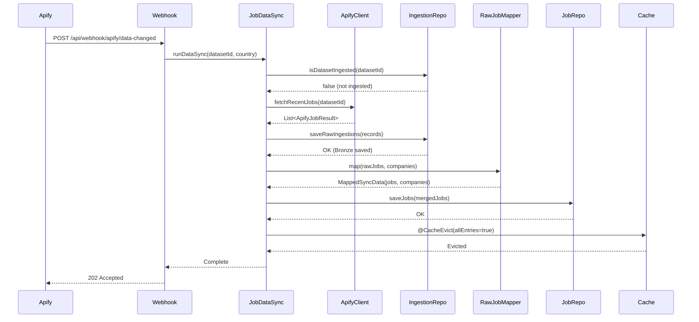
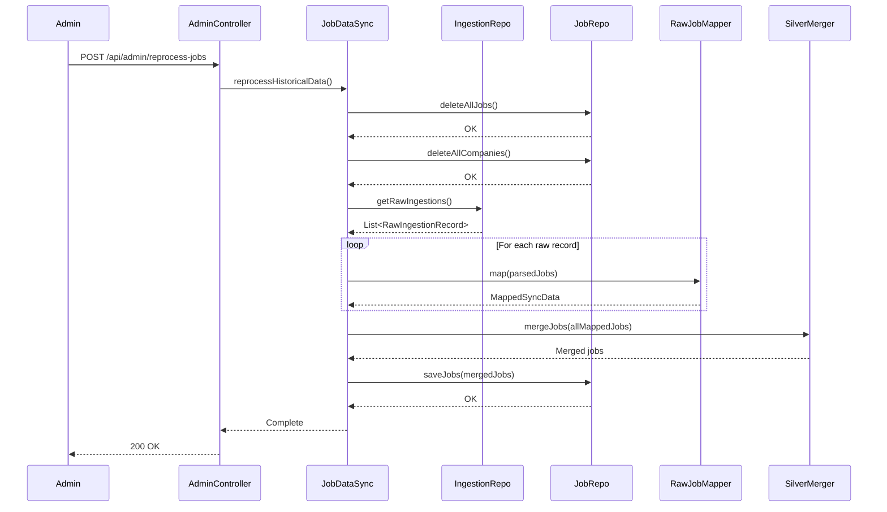
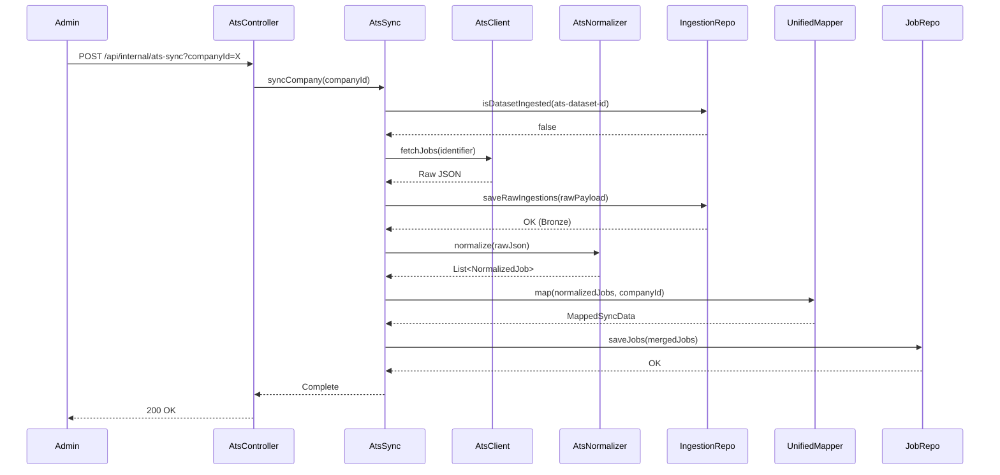

# Data Pipeline Flowchart

This document contains a comprehensive Mermaid.js flowchart showing how data flows through the DevAssembly job market reporting system.

## Full Data Pipeline Diagram

```mermaid
flowchart TB
    subgraph DataSources["📥 Data Sources (External)"]
        direction TB
        LinkedIn["LinkedIn Job Postings"]
        ApifyScraper["Apify Scraper API"]
        ATS["Company ATS Systems<br/>(Greenhouse, Lever, etc.)"]
        ManualData["📄 companies.json<br/>Master Manifest"]
    end

    subgraph Ingestion["🔄 Ingestion Layer"]
        direction TB
        Webhook["ApifyWebhookController<br/>/api/webhook/apify/data-changed"]
        WebhookNZ["🇳🇿 /api/webhook/apify/nz/data-changed"]
        WebhookAU["🇦🇺 /api/webhook/apify/au/data-changed"]
        ATSController["AtsSyncController<br/>/api/internal/ats-sync"]
        AdminController["AdminController<br/>/api/admin/trigger-sync"]
    end

    subgraph Orchestration["⚙️ Orchestration Services"]
        direction TB
        JobDataSync["JobDataSyncService<br/>runDataSync"]
        AtsSync["AtsJobDataSyncService<br/>syncCompany"]
        CompanySync["CompanySyncService<br/>syncFromManifest"]
        Reprocess["JobDataSyncService<br/>reprocessHistoricalData"]
    end

    subgraph Bronze["🥉 Bronze Layer (Raw Storage)"]
        direction TB
        RawIngestion[("raw_ingestions<br/>Table")]
        RawIngestionDesc["Immutable JSON payloads<br/>with datasetId tracking"]
    end

    subgraph Silver["🥈 Silver Layer (Structured Data)"]
        direction TB
        RawJobs[("raw_jobs<br/>Table")]
        RawCompanies[("raw_companies<br/>Table")]
        JobsDesc["Deduplicated job roles<br/>with extracted technologies"]
        CompaniesDesc["Verified + Unverified<br/>company records"]
    end

    subgraph Processing["🔧 Data Processing"]
        direction TB
        ApifyClient["ApifyClient<br/>Fetch recent jobs"]
        RawJobMapper["RawJobDataMapper<br/>Map & Deduplicate"]
        RawJobParser["RawJobDataParser<br/>Extract: Tech, Location,<br/>Seniority, Work Model"]
        UnifiedMapper["AtsJobDataMapper<br/>ATS Data Mapping"]
        AtsNormalizer["AtsNormalizer<br/>ATS-specific parsing"]
        TechClassifier["TechRoleClassifier<br/>Filter tech roles only"]
        SilverMerger["SilverDataMerger<br/>Merge with existing data"]
        PiiSanitizer["PiiSanitizer<br/>Remove sensitive data"]
    end

    subgraph Persistence["💾 Persistence Layer"]
        direction TB
        JobRepo["JobRepository<br/>BigQuery Streaming"]
        CompanyRepo["CompanyRepository<br/>BigQuery CRUD"]
        IngestionRepo["IngestionRepository<br/>Bronze Layer Access"]
        AtsConfigRepo["AtsConfigRepository<br/>Sync Status Tracking"]
    end

    subgraph API["🌐 API Layer (BFF)"]
        direction TB
        LandingAPI["LandingController<br/>/api/landing"]
        TechAPI["TechController<br/>/api/tech/{techName}"]
        CompanyAPI["CompanyController<br/>/api/company/{companyId}"]
        JobAPI["JobController<br/>/api/job/{jobId}"]
        SearchAPI["SearchController<br/>/api/search/suggestions"]
        AnalyticsRepo["AnalyticsRepository<br/>Aggregation Queries"]
        TechRepo["TechRepository<br/>Tech-specific queries"]
    end

    subgraph Cache["💨 Application Cache"]
        direction TB
        CacheLanding["@Cacheable('landing')"]
        CacheTech["@Cacheable('tech')"]
        CacheCompany["@Cacheable('company')"]
        CacheSearch["@Cacheable('search')"]
    end

    subgraph Frontend["💻 Frontend (React/Vite)"]
        direction TB
        LandingPage["Landing Page<br/>Global Stats, Top Tech,<br/>Top Companies"]
        TechPage["Tech Details Page<br/>Role distribution,<br/>Hiring companies"]
        CompanyPage["Company Profile Page<br/>Tech stack, Insights,<br/>Active roles"]
        JobPage["Job Details Page<br/>Full description,<br/>Apply links, Similar roles"]
        SearchUI["Search UI<br/>Tech & Company suggestions"]
        CountrySelector["Country Selector<br/>(NZ/AU/ES)"]
    end

    subgraph Automation["⏰ Automation"]
        direction TB
        CloudScheduler["Google Cloud Scheduler<br/>Weekly Triggers"]
        ApifyWebhook["Apify Webhook<br/>On data change"]
    end

    %% Data Source Flows
    LinkedIn -->|Scraped via API| ApifyScraper
    ApifyScraper -->|JSON Payload| Webhook
    ApifyScraper -->|JSON Payload| WebhookNZ
    ApifyScraper -->|JSON Payload| WebhookAU
    
    ATS -->|Direct API| AtsSync
    ManualData -->|File Read| CompanySync

    %% Webhook to Orchestration
    Webhook -->|Trigger| JobDataSync
    WebhookNZ -->|Trigger + Country=NZ| JobDataSync
    WebhookAU -->|Trigger + Country=AU| JobDataSync
    ATSController -->|Trigger| AtsSync
    AdminController -->|Manual Trigger| JobDataSync
    AdminController -->|Manual Trigger| CompanySync

    %% Orchestration to Processing
    JobDataSync -->|1. Fetch| ApifyClient
    JobDataSync -->|2. Bronze Save| IngestionRepo
    JobDataSync -->|3. Company Refresh| CompanySync
    JobDataSync -->|4. Map Jobs| RawJobMapper
    JobDataSync -->|5. Merge| SilverMerger
    
    AtsSync -->|1. Fetch| AtsNormalizer
    AtsSync -->|2. Bronze Save| IngestionRepo
    AtsSync -->|3. Map| UnifiedMapper
    AtsSync -->|4. Merge| SilverMerger

    %% Processing Details
    ApifyClient -->|Raw DTOs| RawJobMapper
    RawJobMapper -->|Group by Role| RawJobParser
    RawJobMapper -->|Extract Tech| RawJobParser
    RawJobMapper -->|Parse Location| RawJobParser
    RawJobMapper -->|Sanitize| PiiSanitizer
    RawJobMapper -->|Filter| TechClassifier
    
    AtsNormalizer -->|Normalized Jobs| UnifiedMapper
    UnifiedMapper -->|Tech Filter| TechClassifier

    %% Bronze Layer
    IngestionRepo -->|Stream JSON| RawIngestion
    RawIngestion --- RawIngestionDesc

    %% Silver Layer
    SilverMerger -->|Upsert| RawJobs
    SilverMerger -->|Upsert| RawCompanies
    RawJobs --- JobsDesc
    RawCompanies --- CompaniesDesc

    %% Repository Connections
    RawJobs -.->|Read/Write| JobRepo
    RawCompanies -.->|Read/Write| CompanyRepo
    RawIngestion -.->|Read/Write| IngestionRepo

    %% Reprocessing Flow
    Reprocess -->|Read All| IngestionRepo
    Reprocess -->|Re-map| RawJobMapper
    Reprocess -->|Delete All| JobRepo
    Reprocess -->|Delete All| RawCompanies
    Reprocess -->|Re-insert| SilverMerger

    %% API to Repository
    LandingAPI -->|Aggregated Stats| AnalyticsRepo
    TechAPI -->|Tech Jobs| TechRepo
    CompanyAPI -->|Company Data| CompanyRepo
    JobAPI -->|Job Details| JobRepo
    SearchAPI -->|Suggestions| TechRepo
    SearchAPI -->|Suggestions| CompanyRepo

    AnalyticsRepo -.->|Query| RawJobs
    TechRepo -.->|Query| RawJobs
    CompanyRepo -.->|Query| RawCompanies
    JobRepo -.->|Query| RawJobs

    %% Caching
    LandingAPI -->|Cache Result| CacheLanding
    TechAPI -->|Cache Result| CacheTech
    CompanyAPI -->|Cache Result| CacheCompany
    SearchAPI -->|Cache Result| CacheSearch

    %% Frontend Connections
    LandingPage -->|GET /api/landing| LandingAPI
    TechPage -->|"GET /api/tech/{tech}"| TechAPI
    CompanyPage -->|"GET /api/company/{id}"| CompanyAPI
    JobPage -->|"GET /api/job/{id}"| JobAPI
    SearchUI -->|GET /api/search/suggestions| SearchAPI

    %% Cache to API
    CacheLanding -.->|Serve Cached| LandingAPI
    CacheTech -.->|Serve Cached| TechAPI
    CacheCompany -.->|Serve Cached| CompanyAPI
    CacheSearch -.->|Serve Cached| SearchAPI

    %% Country Context
    CountrySelector -.->|Filters All Queries| Frontend

    %% Automation Triggers
    CloudScheduler -->|Trigger| ApifyWebhook
    ApifyWebhook -->|POST webhook| Webhook

    %% Styling
    classDef dataSource fill:#e1f5fe,stroke:#01579b,stroke-width:2px,color:#01579b
    classDef ingestion fill:#fff3e0,stroke:#e65100,stroke-width:2px,color:#e65100
    classDef orchestration fill:#f3e5f5,stroke:#4a148c,stroke-width:2px,color:#4a148c
    classDef bronze fill:#ffebee,stroke:#b71c1c,stroke-width:2px,color:#b71c1c
    classDef silver fill:#e8f5e9,stroke:#1b5e20,stroke-width:2px,color:#1b5e20
    classDef processing fill:#fff8e1,stroke:#ff6f00,stroke-width:2px,color:#ff6f00
    classDef persistence fill:#eceff1,stroke:#263238,stroke-width:2px,color:#263238
    classDef api fill:#e3f2fd,stroke:#0d47a1,stroke-width:2px,color:#0d47a1
    classDef cache fill:#f1f8e9,stroke:#33691e,stroke-width:2px,color:#33691e
    classDef frontend fill:#fce4ec,stroke:#880e4f,stroke-width:2px,color:#880e4f
    classDef automation fill:#e0f7fa,stroke:#006064,stroke-width:2px,color:#006064

    class LinkedIn,ApifyScraper,ATS,ManualData dataSource
    class Webhook,WebhookNZ,WebhookAU,ATSController,AdminController ingestion
    class JobDataSync,AtsSync,CompanySync,Reprocess orchestration
    class RawIngestion,RawIngestionDesc bronze
    class RawJobs,RawCompanies,JobsDesc,CompaniesDesc silver
    class ApifyClient,RawJobMapper,RawJobParser,UnifiedMapper,AtsNormalizer,TechClassifier,SilverMerger,PiiSanitizer processing
    class JobRepo,CompanyRepo,IngestionRepo,AtsConfigRepo persistence
    class LandingAPI,TechAPI,CompanyAPI,JobAPI,SearchAPI,AnalyticsRepo,TechRepo api
    class CacheLanding,CacheTech,CacheCompany,CacheSearch cache
    class LandingPage,TechPage,CompanyPage,JobPage,SearchUI,CountrySelector frontend
    class CloudScheduler,ApifyWebhook automation
```



## Pipeline Stages Explained

### 1. 📥 Data Sources

| Source | Type | Description |
|--------|------|-------------|
| **LinkedIn** | External | Job postings scraped via Apify API |
| **Apify Scraper** | External Service | Web scraping service that extracts LinkedIn job data |
| **Company ATS** | External | Direct integration with Applicant Tracking Systems (Greenhouse, Lever, etc.) |
| **companies.json** | Internal | Master manifest of verified company data maintained locally |

### 2. 🔄 Ingestion Layer

| Endpoint | Purpose |
|----------|---------|
| `/api/webhook/apify/data-changed` | Global webhook for Apify notifications |
| `/api/webhook/apify/nz/data-changed` | NZ-specific webhook (routes to NZ country filter) |
| `/api/webhook/apify/au/data-changed` | AU-specific webhook (routes to AU country filter) |
| `/api/internal/ats-sync` | Manual trigger for ATS company sync |
| `/api/admin/trigger-sync` | Admin manual sync trigger |
| `/api/admin/reprocess-jobs` | Trigger historical data reprocessing |

### 3. ⚙️ Orchestration Services

| Service | Responsibility |
|---------|----------------|
| **JobDataSyncService** | Orchestrates Apify data sync pipeline (Bronze → Silver) |
| **AtsJobDataSyncService** | Orchestrates direct ATS integration pipeline |
| **CompanySyncService** | Syncs master manifest from companies.json |
| **reprocessHistoricalData** | Re-runs mapping pipeline on all Bronze data |

### 4. 🥉 Bronze Layer (Raw Storage)

**Table: `raw_ingestions`**

| Column | Type | Description |
|--------|------|-------------|
| `id` | STRING | Unique record ID |
| `source` | STRING | "LinkedIn-Apify" or ATS provider name |
| `ingestedAt` | TIMESTAMP | When the data was ingested |
| `rawPayload` | STRING | Full original JSON (immutable) |
| `datasetId` | STRING | Apify dataset ID for deduplication |

**Key Characteristics:**
- ✅ **Immutable** - Never modified or deleted
- ✅ **Audit Trail** - Complete history of all ingested data
- ✅ **Reprocessable** - Can rebuild Silver layer from Bronze at any time

### 5. 🥈 Silver Layer (Structured Data)

**Table: `raw_jobs`**

| Column | Type | Description |
|--------|------|-------------|
| `jobId` | STRING | Stable composite ID (companyId + country + title + date) |
| `companyId` | STRING | Reference to company |
| `country` | STRING | ISO country code (NZ/AU/ES) |
| `title` | STRING | Normalized job title |
| `locations` | ARRAY<STRING> | All locations where role is posted |
| `technologies` | ARRAY<STRING> | Extracted tech stack |
| `seniorityLevel` | STRING | Junior/Mid/Senior/Lead |
| `workModel` | STRING | Remote/Hybrid/On-site |
| `salaryMin` | INT64 | Minimum salary (if available) |
| `salaryMax` | INT64 | Maximum salary (if available) |
| `postedDate` | DATE | Original posting date |
| `lastSeenAt` | TIMESTAMP | Last time job was seen active |

**Table: `raw_companies`**

| Column | Type | Description |
|--------|------|-------------|
| `companyId` | STRING | Unique company identifier |
| `name` | STRING | Company name |
| `alternateNames` | ARRAY<STRING> | Name aliases for matching |
| `verificationLevel` | STRING | verified/unverified/blocked |
| `technologies` | ARRAY<STRING> | Aggregated tech stack from jobs |
| `hiringLocations` | ARRAY<STRING> | All active hiring locations |
| `remotePolicy` | STRING | Company-wide remote policy |

### 6. 🔧 Data Processing Components

| Component | Function |
|-----------|----------|
| **ApifyClient** | Fetches recent jobs from Apify dataset API |
| **RawJobDataMapper** | Groups postings by logical role, handles deduplication |
| **RawJobDataParser** | Extracts technologies, locations, seniority, work model |
| **TechRoleClassifier** | Filters to include only technology-related roles |
| **PiiSanitizer** | Removes personal/sensitive information from descriptions |
| **SilverDataMerger** | Merges new data with existing Silver records |
| **AtsJobDataMapper** | Maps ATS-normalized jobs to Silver schema |
| **AtsNormalizer** | Provider-specific JSON normalization |

### 7. 💾 Persistence Layer

All persistence uses **Google BigQuery** via Spring Cloud GCP:

| Repository | Operations |
|------------|------------|
| **IngestionRepository** | Save raw payloads, fetch for reprocessing, check dataset ingestion status |
| **JobRepository** | Stream jobs, delete by IDs, delete all (for reprocess), query by filters |
| **CompanyRepository** | CRUD operations, manifest sync, verified company management |
| **AtsConfigRepository** | Track ATS sync status and timestamps |

### 8. 🌐 API Layer (Backend-for-Frontend)

| Endpoint | Method | Response | Cache |
|----------|--------|----------|-------|
| `GET /api/landing` | GET | LandingPageDto | ✅ @Cacheable('landing') |
| `GET /api/tech/{techName}` | GET | TechDetailsPageDto | ✅ @Cacheable('tech') |
| `GET /api/company/{companyId}` | GET | CompanyProfilePageDto | ✅ @Cacheable('company') |
| `GET /api/job/{jobId}` | GET | JobPageDto | ❌ (real-time) |
| `GET /api/search/suggestions` | GET | SearchSuggestionsResponse | ✅ @Cacheable('search') |
| `POST /api/feedback` | POST | void | ❌ |

### 9. 💨 Caching Strategy

**Spring Cache with Caffeine/Redis:**

| Cache Name | TTL | Invalidation |
|------------|-----|--------------|
| `landing` | Until explicit eviction | On data sync completion |
| `tech` | Until explicit eviction | On data sync completion |
| `company` | Until explicit eviction | On data sync completion |
| `search` | Until explicit eviction | On data sync completion |

Cache eviction triggered by `@CacheEvict` on sync services.

### 10. 💻 Frontend Architecture

| Component | Technology | Purpose |
|-----------|------------|---------|
| **React 18** | Framework | UI component tree |
| **Vite** | Build Tool | Fast HMR and bundling |
| **Zustand** | State Management | Global state (country selector, theme) |
| **React Router v6** | Routing | Page navigation |
| **Recharts** | Visualization | Charts and graphs |
| **Tailwind CSS** | Styling | Responsive design system |

**Country Context Flow:**
```
User selects country → Zustand store → Persists to localStorage → 
All API calls append ?country=CODE → Backend filters data → 
UI renders country-specific content
```

## Key Data Flows

### Flow 1: Apify Webhook Triggered Sync



### Flow 2: Historical Data Reprocessing



### Flow 3: ATS Direct Integration Sync



## Data Quality & Deduplication

### Multi-Pass Deduplication Strategy

1. **Platform Level**: Apify dataset ID prevents duplicate ingestion runs
2. **Role Level**: Jobs grouped by `(companyId, country, titleSlug)` 
3. **Opening Level**: Multiple postings clustered by date proximity (14-day window)
4. **Identity Level**: Stable `jobId` generated from `(companyId, country, title, earliestPostedDate)`

### Data Freshness Rules

- **Active Jobs**: Posted within last 6 months
- **Stale Jobs**: Automatically filtered out during Silver mapping
- **Archive**: Bronze layer retains all historical data indefinitely

## Technology Stack Summary

| Layer | Technology |
|-------|------------|
| **Backend Framework** | Spring Boot 3.x + Kotlin |
| **Data Warehouse** | Google BigQuery |
| **Cloud Hosting** | Google Cloud Run |
| **Automation** | Cloud Scheduler + Apify Webhooks |
| **Frontend** | React 18 + Vite + TypeScript |
| **State Management** | Zustand |
| **Styling** | Tailwind CSS |
| **Charts** | Recharts |
| **Caching** | Spring Cache (Caffeine/Redis) |
| **Build** | Gradle (Kotlin DSL) + npm |

## Extension Points

For developers extending the pipeline, key integration points:

1. **New Data Sources**: Implement `AtsClient` + `AtsNormalizer` for new ATS providers
2. **New Processing**: Add extraction logic to `RawJobDataParser`
3. **New APIs**: Add BFF endpoints in `*Controller` classes with `@Cacheable`
4. **New Frontend Pages**: Add React components in `frontend/src/pages/`
5. **Custom Aggregations**: Extend `AnalyticsRepository` with new BigQuery queries
