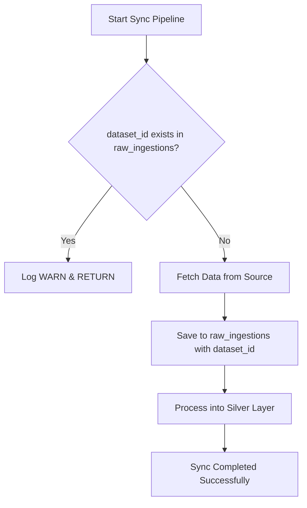

# Ingestion Guard: Preventing Duplicate Dataset Processing (Single Table Approach)

## Context
Our data pipeline currently ingests datasets from Apify (LinkedIn scrapers) and direct ATS integrations. A common scenario is that the same dataset ID might be triggered multiple times, either manually through the Admin UI or automatically via webhooks. 

While our Silver layer handles deduplication, re-processing the same data is inefficient and increases GCP costs. We want a way to skip redundant ingestions while ensuring traceability.

## Proposed Solution: The `dataset_id` Field

Instead of a separate registry, we will add a `dataset_id` field directly to the existing `raw_ingestions` table.

### 1. Schema Update (`raw_ingestions`)
We will add a new column to the Bronze layer table:
| Field | Type | Description |
| :--- | :--- | :--- |
| `dataset_id` | STRING (NULLABLE) | The external ID of the dataset (e.g., Apify Dataset ID, ATS Board ID + Timestamp). |

### 2. Integration Flow
The `JobDataSyncService` and `AtsJobDataSyncService` will check for the existence of this ID before starting a sync.

## Unit Testing Strategy

To ensure robustness, we will implement the following test cases in `JobDataSyncServiceTest` and `AtsJobDataSyncServiceTest`:

### `JobDataSyncServiceTest`
- **Duplicate Prevention**: Mock `ingestionRepository.isDatasetIngested(datasetId)` to return `true`. Verify that `apifyClient.fetchRecentJobs` is never called and the service returns early.
- **New Ingestion Path**: Mock `isDatasetIngested` to return `false`. Verify that the sync proceeds, and `RawIngestionRecord` is created with the correct `datasetId`.

### `IngestionBigQueryRepositoryTest`
- **Repository Implementation**: Verify the SQL query uses `LIMIT 1` for efficiency.
- **Table Creation**: Ensure `ensureTable` correctly handles the new field additions or missing columns on first run.

## Improvements & Considerations

### 1. ATS Support
Currently, `AtsJobDataSyncService` uses a random UUID for each sync even for the same board. 
- **Suggestion**: We should derive a `dataset_id` for ATS syncs too, perhaps using `companyId + atsProvider + ISO8601Timestamp` (e.g. `google-greenhouse-2023-11-20`). This prevents duplicate runs of the same daily sync if triggered twice.

### 2. Historical Data
Existing records in `raw_ingestions` have a `null` `dataset_id`.
- **Consideration**: The guard should treat `null` as "unknown", meaning a new sync with a valid `dataset_id` will still proceed (as intended). 

### 3. BigQuery Performance (Optimization)
As the `raw_ingestions` table grows into the millions of rows:
- **Suggestion**: We should consider **Clustering** the BigQuery table by `dataset_id`. This makes `SELECT 1 FROM ... WHERE dataset_id = ?` extremely efficient and saves on query costs.

### 4. Handling Race Conditions
If two syncs for the same `dataset_id` are triggered at *exactly* the same second:
- **Consideration**: In a distributed environment, two nodes might both see `isDatasetIngested = false` simultaneously.
- **Mitigation**: While rare for our current scale, we could implement a "PENDING" status if we used a separate table, but with the single table approach, we rely on the `LIMIT 1` check. For maximum safety, a unique constraint/index in a traditional database would work, but BigQuery doesn't enforce primary key uniqueness. We'll accept this small window or use a distributed lock (e.g. Redis) if it becomes a problem.

### 5. Partial Success & Manual Recovery
If the sync fails *after* writing to `raw_ingestions` but *before* Silver layer processing:
- **Observation**: The `dataset_id` will exist in `raw_ingestions`, so subsequent attempts will skip it. 
- **Recommendation**: This is actually desirable because the "audit trail" is already there. The user can simply call `reprocessHistoricalData()` which ignores the guard and re-maps all raw records to Silver. Alternatively, they can manually run `DELETE FROM raw_ingestions WHERE datasetId = '...'` to redo the entire sync including the fetch.
