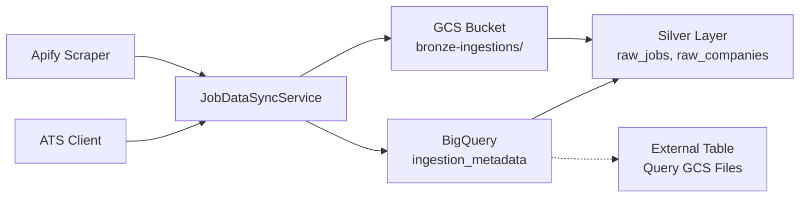

# File-Based Cold Storage for Dataset Ingestions

**Status:** Proposed  
**Priority:** High (Before scaling ingestion rate)  
**Date:** March 10, 2026  
**Author:** Tech Market Team

---

## Executive Summary

This plan outlines the migration of our Bronze layer (`raw_ingestions`) from BigQuery-native storage to **Google Cloud Storage (GCS) file-based cold storage**. This change will significantly reduce storage costs and improve scalability as we increase ingestion frequency with daily Apify scrapes and ATS integrations for every company.

### Current State
- Raw JSON payloads stored directly in BigQuery `raw_ingestions` table
- Each ingestion writes full JSON string to BigQuery rows
- Cost: ~$0.50/GB/month for active storage + query costs
- No compression optimization for historical data

### Target State
- Raw JSON payloads stored as compressed files in GCS buckets
- BigQuery external table or minimal metadata index for querying
- Cost: ~$0.02/GB/month for coldline storage + minimal BigQuery costs
- Automatic lifecycle policies for cost optimization

---

## 1. Motivation

### 1.1 Cost Efficiency

| Storage Type | Cost/GB/Month | Example (100GB) |
|--------------|---------------|-----------------|
| BigQuery Active | ~$0.50 | ~$50/month |
| GCS Coldline | ~$0.02 | ~$2/month |
| **Savings** | **96%** | **~$48/month** |

With daily Apify scrapes + ATS integrations for 50+ companies, we expect:
- **Current:** ~10GB/month → ~$5/month
- **Scaled:** ~500GB/month → ~$250/month (BigQuery) vs ~$10/month (GCS Coldline)

### 1.2 Scalability

- BigQuery row limits and streaming quotas become bottlenecks at high ingestion rates
- GCS has no practical limits on object count or size
- File-based storage enables better compression (gzip, parquet)

### 1.3 Data Lifecycle Management

- GCS lifecycle policies automatically transition old data to cheaper storage classes
- Easy archival to Glacier-equivalent (Archive storage class) after 90 days
- Simplified data retention and deletion policies

---

## 2. Architecture

### 2.1 Target Architecture



### 2.2 Storage Structure

```
gs://techmarket-bronze-ingestions/
├── apify/
│   ├── 2026/
│   │   ├── 03/
│   │   │   ├── 10/
│   │   │   │   ├── dataset-{id}/
│   │   │   │   │   ├── manifest.json
│   │   │   │   │   ├── jobs-0001.json.gz
│   │   │   │   │   └── jobs-0002.json.gz
│   │   │   │   └── dataset-{id}/
│   │   │   └── dataset-{id}/
│   │   └── dataset-{id}/
│   └── dataset-{id}/
└── ats/
    ├── workday/
    │   └── {company-id}/
    │       └── 2026-03-10.json.gz
    ├── greenhouse/
    └── lever/
```

### 2.3 File Formats

| File Type | Format | Compression | Purpose |
|-----------|--------|-------------|---------|
| Raw Jobs | NDJSON | gzip | Line-delimited JSON for streaming reads |
| Manifest | JSON | none | Metadata about the ingestion (count, timestamp, schema version) |
| Metadata Index | BigQuery | N/A | Queryable index for finding files |

**Recommendation:** Consider **Parquet** format for future optimization (see Section 9.1). Parquet provides:
- 60-80% better compression than NDJSON+gzip
- Predicate pushdown for faster BigQuery queries
- Schema enforcement and type safety

**Chunk Size Strategy:**

| Source | Chunk Size | Rationale |
|--------|------------|-----------|
| Apify (large crawls) | 5,000 records | Fewer, larger files for better BigQuery external table performance |
| ATS integrations | 500 records | Smaller chunks for frequent, small ingestions |
| Mixed/unknown | 2,000 records | Balanced default |

**Example Manifest (`manifest.json`):**
```json
{
  "datasetId": "apify-linkedin-2026-03-10-abc123",
  "source": "apify",
  "ingestedAt": "2026-03-10T14:30:00Z",
  "targetCountry": "NZ",
  "fileCount": 2,
  "recordCount": 847,
  "uncompressedSizeBytes": 12458624,
  "compressedSizeBytes": 2458624,
  "compressionRatio": 0.198,
  "processingStatus": "COMPLETED",
  "schemaVersion": "1.0",
  "files": [
    "gs://techmarket-bronze-ingestions/apify/2026/03/10/dataset-abc123/jobs-0001.json.gz",
    "gs://techmarket-bronze-ingestions/apify/2026/03/10/dataset-abc123/jobs-0002.json.gz"
  ]
}
```

**Metadata Fields:**
- `compressedSizeBytes` vs `uncompressedSizeBytes`: Track compression efficiency for cost auditing
- `processingStatus`: `PENDING` → `COMPLETED` or `FAILED` — useful for tracking Silver layer mapping progress
- `compressionRatio`: Quick reference for storage optimization monitoring

---

## 3. Implementation Plan

### Phase 1: Infrastructure Setup (Week 1)

#### 1.1 Terraform Resources

**File:** `terraform/gcp/storage_bucket.tf`

```hcl
resource "google_storage_bucket" "bronze_ingestions" {
  name          = "techmarket-bronze-ingestions"
  location      = var.gcp_region
  project       = var.gcp_project_id
  storage_class = "STANDARD"  # Transition to COLDLINE via lifecycle
  
  uniform_bucket_level_access = true
  
  # Lifecycle rules for cost optimization
  lifecycle_rule {
    condition {
      age = 90  # Days
    }
    action {
      type          = "SetStorageClass"
      storage_class = "COLDLINE"
    }
  }
  
  lifecycle_rule {
    condition {
      age = 365  # 1 year
    }
    action {
      type          = "SetStorageClass"
      storage_class = "ARCHIVE"
    }
  }
}

resource "google_storage_bucket_iam_member" "backend_writer" {
  bucket = google_storage_bucket.bronze_ingestions.name
  role   = "roles/storage.objectCreator"
  member = "serviceAccount:${google_service_account.backend.email}"
}

resource "google_storage_bucket_iam_member" "backend_reader" {
  bucket = google_storage_bucket.bronze_ingestions.name
  role   = "roles/storage.objectViewer"
  member = "serviceAccount:${google_service_account.backend.email}"
}
```

**File:** `terraform/gcp/bigquery_external_table.tf`

```hcl
resource "google_bigquery_table" "raw_ingestions_external" {
  dataset_id = google_bigquery_dataset.techmarket.dataset_id
  table_id   = "raw_ingestions_external"
  
  external_data_configuration {
    autodetect            = true
    source_format         = "NEWLINE_DELIMITED_JSON"
    compression           = "GZIP"
    ignore_unknown_values = true
    
    source_uris = [
      "gs://techmarket-bronze-ingestions/apify/**/*.json.gz",
      "gs://techmarket-bronze-ingestions/ats/**/*.json.gz",
    ]
    
    json_options {
      encoding = "UTF-8"
    }
  }
  
  deletion_protection = false
}

# Metadata table with clustering for query optimization
resource "google_bigquery_table" "ingestion_metadata" {
  dataset_id = google_bigquery_dataset.techmarket.dataset_id
  table_id   = "ingestion_metadata"
  
  schema = <<EOF
[
  {"name": "dataset_id", "type": "STRING", "mode": "REQUIRED"},
  {"name": "source", "type": "STRING", "mode": "REQUIRED"},
  {"name": "ingested_at", "type": "TIMESTAMP", "mode": "REQUIRED"},
  {"name": "target_country", "type": "STRING"},
  {"name": "schema_version", "type": "STRING"},
  {"name": "record_count", "type": "INTEGER"},
  {"name": "file_count", "type": "INTEGER"},
  {"name": "uncompressed_size_bytes", "type": "INTEGER"},
  {"name": "compressed_size_bytes", "type": "INTEGER"},
  {"name": "compression_ratio", "type": "FLOAT"},
  {"name": "processing_status", "type": "STRING"},
  {"name": "files", "type": "STRING", "mode": "REPEATED"},
  {"name": "metadata_id", "type": "STRING"}
]
EOF

  # Clustering for query performance and cost reduction
  # Queries filtering by source + date range will scan less data
  clustering = ["source", "ingested_at"]
  
  deletion_protection = false
}
```

#### 1.2 Environment Variables

**Update:** `.env.example`

```bash
# GCS Storage Configuration
GCS_BRONZE_BUCKET=techmarket-bronze-ingestions
GCS_PROJECT_ID=your-project-id

# BigQuery Configuration (existing)
GCP_PROJECT_ID=your-project-id
GCP_REGION=australia-southeast1
```

---

### Phase 2: Backend Implementation (Week 2)

#### 2.1 New Repository Interface

**File:** `backend/src/main/kotlin/com/techmarket/persistence/ingestion/BronzeRepository.kt`

```kotlin
package com.techmarket.persistence.ingestion

import com.techmarket.persistence.model.BronzeIngestionManifest

/**
 * Repository for Bronze layer storage operations.
 * Supports both GCS file storage and metadata indexing.
 */
interface BronzeRepository {
    /**
     * Save raw ingestion data to GCS as compressed files.
     * @param manifest The metadata manifest with file paths
     * @param dataChunks The raw JSON data chunks to write (one per file in manifest.files)
     * @return The saved manifest with confirmed GCS file paths
     */
    fun saveIngestion(manifest: BronzeIngestionManifest, dataChunks: List<ByteArray>): BronzeIngestionManifest
    
    /**
     * Retrieve a specific ingestion manifest by dataset ID.
     */
    fun getManifest(datasetId: String): BronzeIngestionManifest?
    
    /**
     * Check if a dataset has already been ingested.
     */
    fun isDatasetIngested(datasetId: String): Boolean
    
    /**
     * List all manifests for historical reprocessing.
     * Optionally filtered by source and date range.
     */
    fun listManifests(
        source: String? = null,
        fromDate: Instant? = null,
        toDate: Instant? = null
    ): List<BronzeIngestionManifest>
    
    /**
     * Read raw JSON data from a GCS file.
     */
    fun readFile(filePath: String): InputStream
}
```

#### 2.2 New Data Models

**File:** `backend/src/main/kotlin/com/techmarket/persistence/model/BronzeIngestionManifest.kt`

```kotlin
package com.techmarket.persistence.model

import java.time.Instant

/**
 * Metadata manifest for a Bronze layer ingestion.
 * Stored in BigQuery for querying, with pointers to GCS files.
 */
data class BronzeIngestionManifest(
    val datasetId: String,
    val source: String,  // "apify", "workday", "greenhouse", etc.
    val ingestedAt: Instant,
    val targetCountry: String?,
    val schemaVersion: String = "1.0",
    val recordCount: Int,
    val fileCount: Int,
    val uncompressedSizeBytes: Long,
    val compressedSizeBytes: Long,
    val compressionRatio: Double,
    val processingStatus: ProcessingStatus = ProcessingStatus.PENDING,
    val files: List<String>,  // GCS paths: "gs://bucket/path/to/file.json.gz"
    val metadataId: String? = null  // BigQuery row ID
)

enum class ProcessingStatus {
    PENDING,      // Uploaded to GCS, not yet processed to Silver
    COMPLETED,    // Successfully mapped to Silver layer
    FAILED        // Silver layer mapping failed
}

/**
 * Configuration for GCS bucket access.
 */
data class GcsConfig(
    val bucketName: String,
    val projectId: String,
    val compressionEnabled: Boolean = true
)
```

#### 2.3 GCS Repository Implementation

**File:** `backend/src/main/kotlin/com/techmarket/persistence/ingestion/BronzeGcsRepository.kt`

```kotlin
package com.techmarket.persistence.ingestion

import com.fasterxml.jackson.databind.ObjectMapper
import com.fasterxml.jackson.module.kotlin.kotlinModule
import com.google.cloud.storage.BlobId
import com.google.cloud.storage.BlobInfo
import com.google.cloud.storage.Storage
import com.google.cloud.storage.StorageOptions
import com.techmarket.persistence.model.BronzeIngestionManifest
import java.io.ByteArrayInputStream
import java.io.InputStream
import java.time.Instant
import java.time.ZoneOffset
import java.time.format.DateTimeFormatter
import java.util.UUID
import org.slf4j.LoggerFactory
import org.springframework.beans.factory.annotation.Value
import org.springframework.stereotype.Repository

@Repository
class BronzeGcsRepository(
    private val gcsConfig: GcsConfig,
    private val metadataRepository: IngestionMetadataRepository,
    private val objectMapper: ObjectMapper
) : BronzeRepository {

    private val log = LoggerFactory.getLogger(BronzeGcsRepository::class.java)
    private val storage: Storage = StorageOptions.getDefaultInstance().service
    private val jsonMapper = objectMapper.copy().registerModule(kotlinModule())

    /**
     * Save raw ingestion data to GCS as compressed files.
     * @param manifest The metadata manifest with file paths
     * @param dataChunks The raw JSON data chunks to write (one per file in manifest.files)
     */
    override fun saveIngestion(manifest: BronzeIngestionManifest, dataChunks: List<ByteArray>): BronzeIngestionManifest {
        log.info("Saving Bronze ingestion: datasetId=${manifest.datasetId}, files=${manifest.fileCount}")
        
        val uploadedFiles = mutableListOf<String>()

        try {
            // Upload files to GCS - dataChunks must match manifest.files count
            uploadedFiles.addAll(manifest.files.mapIndexed { index, gcsPath ->
                uploadToGcs(gcsPath, dataChunks[index])
                gcsPath
            })

            // Save manifest metadata to BigQuery
            val savedManifest = manifest.copy(files = uploadedFiles)
            metadataRepository.saveManifest(savedManifest)

            log.info("Bronze ingestion saved successfully: ${savedManifest.files.size} files")
            return savedManifest
        } catch (e: Exception) {
            log.error("Failed to save Bronze ingestion: ${e.message}. Cleaning up orphaned GCS files...")

            // Cleanup: Delete any GCS files that were already uploaded
            uploadedFiles.forEach { gcsPath ->
                try {
                    deleteFromGcs(gcsPath)
                    log.debug("Cleaned up orphaned GCS file: $gcsPath")
                } catch (cleanupEx: Exception) {
                    log.warn("Failed to cleanup orphaned GCS file $gcsPath: ${cleanupEx.message}")
                }
            }

            throw e
        }
    }

    private fun uploadToGcs(gcsPath: String, data: ByteArray) {
        val bucket = storage.get(gcsConfig.bucketName)
        val blobId = BlobId.of(gcsConfig.bucketName, gcsPath.removePrefix("gs://${gcsConfig.bucketName}/"))
        val blobInfo = BlobInfo.newBuilder(blobId)
            .setContentType("application/json")
            .apply {
                if (gcsConfig.compressionEnabled) {
                    setContentEncoding("gzip")
                }
            }
            .build()

        val compressedData = compressIfEnabled(data)

        bucket.create(blobInfo.name, compressedData)
        log.debug("Uploaded file to GCS: $gcsPath (${compressedData.size} bytes)")
    }

    private fun deleteFromGcs(gcsPath: String): Boolean {
        return try {
            val bucket = storage.get(gcsConfig.bucketName)
            val blobName = gcsPath.removePrefix("gs://${gcsConfig.bucketName}/")
            val deleted = bucket.delete(blobName)
            log.debug("Deleted GCS file: $gcsPath, success=$deleted")
            deleted
        } catch (e: Exception) {
            log.warn("Failed to delete GCS file $gcsPath: ${e.message}")
            false
        }
    }

    override fun getManifest(datasetId: String): BronzeIngestionManifest? {
        return metadataRepository.getManifest(datasetId)
    }

    override fun isDatasetIngested(datasetId: String): Boolean {
        return metadataRepository.isDatasetIngested(datasetId)
    }

    override fun listManifests(
        source: String?,
        fromDate: Instant?,
        toDate: Instant?
    ): List<BronzeIngestionManifest> {
        return metadataRepository.listManifests(source, fromDate, toDate)
    }

    override fun readFile(filePath: String): InputStream {
        val bucket = storage.get(gcsConfig.bucketName)
        val blobName = filePath.removePrefix("gs://${gcsConfig.bucketName}/")
        val blob = bucket.get(blobName)

        // Note: For large files (>10MB), consider using blob.reader() for streaming reads
        // to avoid loading entire blobs into JVM memory. This is sufficient for current
        // chunk sizes (500-5000 records, ~1-5MB compressed).
        return ByteArrayInputStream(blob.content)
    }

    private fun compressIfEnabled(data: ByteArray): ByteArray {
        return if (gcsConfig.compressionEnabled) {
            compressGzip(data)
        } else {
            data
        }
    }

    private fun compressGzip(data: ByteArray): ByteArray {
        val outputStream = ByteArrayOutputStream()
        GZIPOutputStream(outputStream).use { gzipOutputStream ->
            gzipOutputStream.write(data)
        }
        return outputStream.toByteArray()
    }
}
```

#### 2.4 Metadata Repository (BigQuery)

**File:** `backend/src/main/kotlin/com/techmarket/persistence/ingestion/IngestionMetadataRepository.kt`

```kotlin
package com.techmarket.persistence.ingestion

import com.google.cloud.bigquery.BigQuery
import com.google.cloud.bigquery.Field
import com.google.cloud.bigquery.QueryJobConfiguration
import com.google.cloud.bigquery.Schema
import com.google.cloud.bigquery.StandardSQLTypeName
import com.google.cloud.spring.bigquery.core.BigQueryTemplate
import com.techmarket.persistence.BigQueryTables
import com.techmarket.persistence.model.BronzeIngestionManifest
import java.time.Instant
import org.slf4j.LoggerFactory
import org.springframework.beans.factory.annotation.Value
import org.springframework.stereotype.Repository

/**
 * BigQuery repository for Bronze layer metadata.
 * Stores manifests as queryable rows with pointers to GCS files.
 */
@Repository
class IngestionMetadataRepository(
    private val bigQueryTemplate: BigQueryTemplate,
    private val bigQuery: BigQuery,
    @Value("\${spring.cloud.gcp.bigquery.dataset-name:techmarket}")
    private val datasetName: String
) {
    private val log = LoggerFactory.getLogger(IngestionMetadataRepository::class.java)
    private val tableName = BigQueryTables.INGESTION_METADATA

    fun ensureTable() {
        val schema = Schema.of(
            Field.of("dataset_id", StandardSQLTypeName.STRING),
            Field.of("source", StandardSQLTypeName.STRING),
            Field.of("ingested_at", StandardSQLTypeName.TIMESTAMP),
            Field.of("target_country", StandardSQLTypeName.STRING),
            Field.of("schema_version", StandardSQLTypeName.STRING),
            Field.of("record_count", StandardSQLTypeName.INT64),
            Field.of("file_count", StandardSQLTypeName.INT64),
            Field.of("uncompressed_size_bytes", StandardSQLTypeName.INT64),
            Field.of("compressed_size_bytes", StandardSQLTypeName.INT64),
            Field.of("compression_ratio", StandardSQLTypeName.FLOAT64),
            Field.of("processing_status", StandardSQLTypeName.STRING),
            Field.of("files", StandardSQLTypeName.ARRAY).apply {
                setElementType(StandardSQLTypeName.STRING)
            },
            Field.of("metadata_id", StandardSQLTypeName.STRING)
        )
        bigQuery.ensureTableExists(datasetName, tableName, schema)
    }

    fun saveManifest(manifest: BronzeIngestionManifest) {
        ensureTable()
        // Implementation using bigQueryTemplate.writeJsonStream
    }

    fun getManifest(datasetId: String): BronzeIngestionManifest? {
        ensureTable()
        val query = "SELECT * FROM `$datasetName.$tableName` WHERE dataset_id = @datasetId"
        // Execute query and map result
        return null // TODO: Implement
    }

    fun isDatasetIngested(datasetId: String): Boolean {
        ensureTable()
        val query = "SELECT 1 FROM `$datasetName.$tableName` WHERE dataset_id = @datasetId LIMIT 1"
        // Execute query
        return false // TODO: Implement
    }

    fun listManifests(
        source: String?,
        fromDate: Instant?,
        toDate: Instant?
    ): List<BronzeIngestionManifest> {
        ensureTable()
        // Build dynamic query with filters
        return emptyList() // TODO: Implement
    }
}
```

#### 2.5 Update Sync Services

**File:** `backend/src/main/kotlin/com/techmarket/sync/JobDataSyncService.kt`

```kotlin
@Service
class JobDataSyncService(
    private val apifyClient: ApifyClient,
    private val jobDataMapper: RawJobDataMapper,
    private val jobRepository: JobRepository,
    private val companyRepository: CompanyRepository,
    private val bronzeRepository: BronzeRepository,  // Changed from IngestionRepository
    private val silverDataMerger: SilverDataMerger,
    private val companySyncService: CompanySyncService,
    private val objectMapper: ObjectMapper
) {
    // ...

    @CacheEvict(value = ["landing", "tech", "company", "search"], allEntries = true)
    fun runDataSync(datasetId: String, targetCountry: String? = null) {
        log.info("Starting Job Data Sync Pipeline for dataset: $datasetId")

        // 0. Check if already ingested
        if (bronzeRepository.isDatasetIngested(datasetId)) {
            log.warn("Dataset $datasetId has already been ingested. Skipping.")
            return
        }

        // 1. Fetch from source
        val apifyResults = apifyClient.fetchRecentJobs(datasetId)
        if (apifyResults.isEmpty()) {
            log.info("No jobs fetched from Apify. Aborting sync.")
            return
        }

        val syncTime = Instant.now()

        // 2. Prepare Bronze Layer files
        val manifest = createBronzeManifest(apifyResults, datasetId, syncTime, targetCountry, SOURCE_APIFY)
        bronzeRepository.saveIngestion(manifest, apifyResults.map { it.rawJson }.map { it.toByteArray() })

        // 3. Phase 1: Refresh Master Manifest Companies
        companySyncService.syncFromManifest()

        // 4. Phase 2: Map to Silver Layer
        val manifestCompanies = companyRepository.getAllCompanies().associateBy { it.companyId }
        val rawJobs = apifyResults.map { RawJob(it.dto, syncTime) }
        val mappedData = jobDataMapper.map(rawJobs, manifestCompanies, targetCountry)

        // 5. Merge and persist Silver records
        // ... (existing merge logic)
    }

    private fun createBronzeManifest(
        results: List<ApifyJobResult>,
        datasetId: String,
        syncTime: Instant,
        targetCountry: String?,
        source: String
    ): BronzeIngestionManifest {
        val dateStr = DateTimeFormatter.ISO_LOCAL_DATE
            .withZone(ZoneOffset.UTC)
            .format(syncTime)
        
        // Dynamic chunk sizing based on source
        val chunkSize = when (source) {
            SOURCE_APIFY -> 5000  // Large crawls: fewer, bigger files
            SOURCE_ATS -> 500     // Small, frequent ingestions
            else -> 2000          // Balanced default
        }
        
        val chunks = results.chunked(chunkSize)
        val files = chunks.mapIndexed { index, chunk ->
            "gs://${gcsConfig.bucketName}/$source/$dateStr/dataset-$datasetId/jobs-${String.format("%04d", index + 1)}.json.gz"
        }

        // Calculate sizes for compression tracking
        val uncompressedSize = estimateSize(results)
        val compressedSize = (uncompressedSize * 0.2).toLong()  // ~80% compression with gzip
        
        // Guard against division by zero for empty datasets
        val compressionRatio = if (uncompressedSize > 0) {
            compressedSize.toDouble() / uncompressedSize
        } else {
            1.0  // Default to 1.0 for empty datasets
        }

        return BronzeIngestionManifest(
            datasetId = datasetId,
            source = source,
            ingestedAt = syncTime,
            targetCountry = targetCountry,
            recordCount = results.size,
            fileCount = files.size,
            uncompressedSizeBytes = uncompressedSize,
            compressedSizeBytes = compressedSize,
            compressionRatio = compressionRatio,
            files = files
        )
    }

    @CacheEvict(value = ["landing", "tech", "company", "search"], allEntries = true)
    fun reprocessHistoricalData() {
        log.info("Starting Historical Data Reprocessing...")

        // Wipe Silver layer
        jobRepository.deleteAllJobs()
        companyRepository.deleteAllCompanies()

        // Fetch all manifests from Bronze layer
        val manifests = bronzeRepository.listManifests()
        log.info("Found ${manifests.size} historical manifests for reprocessing.")

        if (manifests.isEmpty()) {
            log.info("No historical records found. Aborting reprocessing.")
            return
        }

        // OPTION A: Backend-based reprocessing (suitable for < 100k records)
        val allRawJobs = manifests.flatMap { manifest ->
            manifest.files.flatMap { filePath ->
                val inputStream = bronzeRepository.readFile(filePath)
                parseJobsFromStream(inputStream, manifest.ingestedAt)
            }
        }

        // Continue with mapping and merge...
        // ... (existing mapping logic)
    }

    /**
     * Alternative: BigQuery-based reprocessing for large-scale historical data.
     * Leverages BigQuery's distributed compute instead of backend JVM memory.
     * 
     * Use this when reprocessing > 100k records or when backend memory is constrained.
     * 
     * NOTE: This example uses PARSE_JSON for flexibility. For better performance,
     * define the external table with explicit schema fields matching your JSON structure.
     * BigQuery will then parse NDJSON automatically without the PARSE_JSON overhead.
     */
    fun reprocessHistoricalDataBigQuery() {
        log.info("Starting BigQuery-based Historical Reprocessing (optimized for large datasets)...")

        // Wipe Silver layer
        jobRepository.deleteAllJobs()
        companyRepository.deleteAllCompanies()

        // OPTION A: Using PARSE_JSON (flexible, works with any JSON structure)
        val sqlWithParse = """
            INSERT INTO `${datasetName}.raw_jobs`
            SELECT 
                PARSE_JSON(payload).jobId AS jobId,
                PARSE_JSON(payload).title AS title,
                -- ... additional field mappings
            FROM `${datasetName}.raw_ingestions_external`
            WHERE processing_status = 'COMPLETED'
        """.trimIndent()

        // OPTION B: Using schema-based external table (faster, recommended for production)
        // Define external table schema matching your JSON structure:
        // {
        //   "name": "jobId", "type": "STRING"
        //   "name": "title", "type": "STRING"
        //   ...
        // }
        // Then query directly without PARSE_JSON:
        val sqlWithSchema = """
            INSERT INTO `${datasetName}.raw_jobs`
            SELECT 
                jobId,
                title,
                company,
                location,
                ingestedAt
            FROM `${datasetName}.raw_ingestions_external`
            WHERE processing_status = 'COMPLETED'
        """.trimIndent()

        val jobConfig = QueryJobConfiguration.newBuilder(sqlWithSchema).build()
        bigQuery.query(jobConfig)

        log.info("BigQuery-based reprocessing completed.")
    }
}
```

**Similar updates required for:**
- `AtsJobDataSyncService.kt`
- `IngestionBigQueryRepository.kt` (deprecate or adapt)

---

### Phase 3: Testing & Validation (Week 3)

#### 3.1 Unit Tests

| Test Class | Coverage |
|------------|----------|
| `BronzeGcsRepositoryTest` | File upload, download, compression, manifest serialization |
| `IngestionMetadataRepositoryTest` | CRUD operations, query filters |
| `JobDataSyncServiceTest` | Updated for Bronze repository, file-based flow |
| `AtsJobDataSyncServiceTest` | ATS-specific Bronze storage |

#### 3.2 Integration Tests

```kotlin
@Test
fun `full sync pipeline writes to GCS and BigQuery metadata`() {
    // Arrange
    val datasetId = "test-dataset-${UUID.randomUUID()}"
    mockApifyClient.returnSampleJobs(100)
    
    // Act
    jobDataSyncService.runDataSync(datasetId, "NZ")
    
    // Assert
    val manifest = bronzeRepository.getManifest(datasetId)
    assertThat(manifest).isNotNull
    assertThat(manifest!!.files).hasSize(1)  // 100 jobs < 500 chunk size
    
    // Verify file exists in GCS
    val fileContent = bronzeRepository.readFile(manifest.files.first())
    assertThat(fileContent.readBytes()).isNotEmpty
    
    // Verify Silver layer populated
    val jobs = jobRepository.getAllJobs()
    assertThat(jobs).isNotEmpty
}

@Test
fun `reprocessHistoricalData reads from GCS files`() {
    // Arrange
    val manifest = createAndSaveTestManifest()
    
    // Act
    jobDataSyncService.reprocessHistoricalData()
    
    // Assert
    val jobs = jobRepository.getAllJobs()
    assertThat(jobs).hasSize(manifest.recordCount)
}
```

#### 3.3 Migration Validation

**Script:** `scripts/deployment/validate-migration.sh`

```bash
#!/bin/bash
# Validate Bronze layer migration to GCS

echo "=== Bronze Layer Migration Validation ==="

# 1. Count records in old BigQuery table
OLD_COUNT=$(bq query --nouse_legacy_sql \
  "SELECT COUNT(*) FROM \`techmarket.raw_ingestions\`" \
  --format=csv | tail -1)

echo "Old BigQuery table: $OLD_COUNT records"

# 2. Count records in new metadata table
NEW_COUNT=$(bq query --nouse_legacy_sql \
  "SELECT SUM(record_count) FROM \`techmarket.ingestion_metadata\`" \
  --format=csv | tail -1)

echo "New metadata table: $NEW_COUNT records"

# 3. Verify GCS files exist
GCS_FILE_COUNT=$(gsutil du -a gs://techmarket-bronze-ingestions/**/*.json.gz | wc -l)
echo "GCS files: $GCS_FILE_COUNT"

# 4. Sample validation - compare random dataset
SAMPLE_DATASET=$(bq query --nouse_legacy_sql \
  "SELECT dataset_id FROM \`techmarket.ingestion_metadata\` LIMIT 1" \
  --format=csv | tail -1)

echo "Validating sample dataset: $SAMPLE_DATASET"

# 5. Run test reprocessing
echo "Running test reprocessing..."
curl -X POST https://api.techmarket.io/admin/reprocess-historical \
  -H "Authorization: Bearer $ADMIN_TOKEN"

echo "=== Validation Complete ==="
```

---

### Phase 4: Migration & Rollout (Week 4)

#### 4.1 Migration Strategy

**Option A: Dual-Write Migration (Recommended)**

1. Deploy new Bronze repository with dual-write capability
2. Write to both BigQuery (old) and GCS (new) for 2 weeks
3. Validate data consistency
4. Switch reads to GCS
5. Disable BigQuery writes
6. Archive old BigQuery table

**Option B: Big Bang Migration**

1. Export all existing `raw_ingestions` to GCS
2. Deploy new code
3. Switch immediately to GCS

#### 4.2 Migration Script

**File:** `scripts/migration/migrate-bronze-to-gcs.sh`

```bash
#!/bin/bash
# Migrate existing BigQuery Bronze data to GCS

set -e

PROJECT_ID="techmarket-prod"
DATASET="techmarket"
OLD_TABLE="raw_ingestions"
GCS_BUCKET="gs://techmarket-bronze-ingestions"

echo "=== Starting Bronze Layer Migration ==="

# 1. Export BigQuery data to GCS (temporary staging)
echo "Exporting BigQuery data to temporary GCS location..."
bq extract \
  --destination_format=NEWLINE_DELIMITED_JSON \
  --compression=GZIP \
  "$DATASET.$OLD_TABLE" \
  "$GCS_BUCKET/migration-staging/raw_ingestions-*.json.gz"

# 2. Transform and reorganize into new structure
echo "Reorganizing files into new structure..."
# (Python script to parse manifest and create proper folder structure)
python3 scripts/migration/reorganize_bronze_files.py \
  --input "$GCS_BUCKET/migration-staging" \
  --output "$GCS_BUCKET" \
  --project "$PROJECT_ID"

# 3. Create metadata table entries
echo "Populating ingestion_metadata table..."
python3 scripts/migration/create_metadata_entries.py \
  --source "$GCS_BUCKET" \
  --dataset "$DATASET" \
  --project "$PROJECT_ID"

# 4. Validate migration
echo "Running validation..."
./scripts/deployment/validate-migration.sh

echo "=== Migration Complete ==="
echo "Next steps:"
echo "1. Review validation report"
echo "2. Deploy new backend code"
echo "3. Update feature flag to enable GCS storage"
echo "4. Monitor for 48 hours"
echo "5. Archive old raw_ingestions table"
```

#### 4.3 Rollback Plan

If issues occur:

1. **Feature Flag:** Keep old `IngestionRepository` code path available
2. **Switch Back:** Update config to use BigQuery repository
3. **Data Sync:** Any new ingestions during GCS period can be backfilled

```bash
# Rollback command
gcloud run services update techmarket-backend \
  --update-env-vars BRONZE_STORAGE_TYPE=bigquery
```

---

## 4. Configuration Changes

### 4.1 Application Properties

**File:** `backend/src/main/resources/application.yml`

```yaml
techmarket:
  bronze:
    storage-type: gcs  # or 'bigquery' for legacy
    gcs:
      bucket-name: ${GCS_BRONZE_BUCKET:techmarket-bronze-ingestions}
      project-id: ${GCS_PROJECT_ID}
      compression-enabled: true
      # Chunk sizes are now source-specific and handled in createBronzeManifest()
      # These config values are kept for reference but not actively used
      chunk-sizes:
        apify: 5000   # Large crawls: fewer, bigger files
        ats: 500      # Small, frequent ingestions
        default: 2000 # Balanced default
```

### 4.2 Feature Flag (Optional)

**File:** `backend/src/main/kotlin/com/techmarket/config/FeatureFlags.kt`

```kotlin
@Configuration
class FeatureFlags(
    @Value("\${techmarket.bronze.storage-type:gcs}")
    private val bronzeStorageType: String
) {
    fun useGcsBronzeStorage(): Boolean = bronzeStorageType == "gcs"
}
```

---

## 5. Cost Analysis

### 5.1 Current Costs (BigQuery Only)

| Component | Monthly Cost | Notes |
|-----------|--------------|-------|
| Storage (500GB) | $250 | $0.50/GB |
| Queries | $50 | Approximate |
| **Total** | **$300** | |

### 5.2 Target Costs (GCS + BigQuery Metadata)

| Component | Monthly Cost | Notes |
|-----------|--------------|-------|
| GCS Standard (100GB) | $2 | First 30 days |
| GCS Coldline (300GB) | $6 | 30-90 days |
| GCS Archive (100GB) | $1.20 | 90+ days |
| BigQuery Metadata | $1 | Minimal metadata only |
| Queries | $10 | Reduced (external table) |
| **Total** | **$20.20** | **93% savings** |

### 5.3 One-Time Migration Costs

| Item | Cost |
|------|------|
| Data export (BigQuery → GCS) | ~$5 (query costs) |
| Engineering time | 2-3 weeks |
| **Total** | **~$5 + labor** |

---

## 6. Risks & Mitigations

| Risk | Impact | Mitigation |
|------|--------|------------|
| **Data Loss During Migration** | High | Dual-write strategy, validate before cutover |
| **GCS Read Latency** | Medium | Cache frequently accessed manifests, use CDN |
| **Compression Overhead** | Low | CPU cost minimal vs storage savings |
| **Schema Evolution** | Medium | Include `schemaVersion` in manifest, versioned folders |
| **Vendor Lock-in** | Low | GCS → S3 migration is straightforward |
| **GCS Early Deletion Charges** | Low | COLDLINE has 90-day minimum, ARCHIVE has 365-day minimum. Lifecycle policies keep data in STANDARD for first 90 days to avoid charges. |

### Operations Note: GCS Minimum Storage Duration

| Storage Class | Minimum Duration | Early Deletion Charge |
|---------------|------------------|----------------------|
| STANDARD | None | None |
| COLDLINE | 90 days | Charged for remaining days |
| ARCHIVE | 365 days | Charged for remaining days |

**Example:** If you delete a COLDLINE object after 30 days, you'll be charged for the remaining 60 days. The lifecycle policy in this plan avoids this by keeping data in STANDARD for the first 90 days before transitioning to COLDLINE.

---

## 7. Success Metrics

| Metric | Target | Measurement |
|--------|--------|-------------|
| Storage Cost Reduction | >90% | Monthly GCP bill |
| Ingestion Latency | <20% increase | Sync pipeline timing |
| Reprocessing Time | <50% increase | Historical reprocess duration |
| Data Integrity | 100% | Validation script results |

---

## 8. Implementation Checklist

### Phase 1: Infrastructure
- [ ] Create Terraform resources for GCS bucket
- [ ] Configure lifecycle policies
- [ ] Set up IAM permissions
- [ ] Create BigQuery metadata table schema
- [ ] Update `.env.example` with GCS variables

### Phase 2: Backend
- [ ] Implement `BronzeRepository` interface
- [ ] Implement `BronzeGcsRepository` with:
  - [ ] Dynamic chunk sizing (500 for ATS, 5000 for Apify)
  - [ ] GCS upload with compression
  - [ ] Orphaned file cleanup on failure
- [ ] Implement `IngestionMetadataRepository` with:
  - [ ] Compression tracking fields
  - [ ] Processing status tracking
- [ ] Create `BronzeIngestionManifest` model with `ProcessingStatus` enum
- [ ] Update `JobDataSyncService` with dual reprocessing strategies
- [ ] Update `AtsJobDataSyncService`
- [ ] Add GCS config properties
- [ ] Add `deleteFromGcs()` helper method

### Phase 3: Testing
- [ ] Write unit tests for GCS repository
- [ ] Write integration tests for full pipeline
- [ ] Create migration validation script
- [ ] Load test with large datasets (10k+ jobs)

### Phase 4: Migration
- [ ] Run dual-write in staging environment
- [ ] Export production data to GCS
- [ ] Validate data integrity
- [ ] Deploy with feature flag
- [ ] Monitor for 48 hours
- [ ] Disable BigQuery writes
- [ ] Archive old table

### Phase 5: Cleanup
- [ ] Remove legacy `IngestionRepository` code
- [ ] Update documentation
- [ ] Add runbook for operations team
- [ ] Schedule quarterly cost review

---

## 9. Future Enhancements

### 9.1 Parquet Format Migration

**Current:** NDJSON + gzip  
**Recommended:** Apache Parquet

| Metric | NDJSON+gzip | Parquet | Improvement |
|--------|-------------|---------|-------------|
| Compression ratio | ~20% | ~5% | 4x better |
| Query performance | Full scan | Predicate pushdown | 10-100x faster |
| Schema enforcement | None | Built-in | Type safety |
| Human readable | ✅ Yes | ❌ Binary | — |

**Implementation:**
```kotlin
// Use Apache Parquet Kotlin library
implementation("org.apache.parquet:parquet-column:1.13.1")
implementation("org.apache.parquet:parquet-hadoop:1.13.1")
```

**When to migrate:**
- ✅ Do it now if: Team is comfortable with JVM Parquet dependencies
- ⏳ Wait if: Human readability of Bronze files is a priority for debugging

**Migration path:**
1. Add Parquet writer to `BronzeGcsRepository`
2. Write both NDJSON and Parquet for 1 week (dual-format)
3. Validate Parquet files with BigQuery external table
4. Switch to Parquet-only
5. Update lifecycle policies for Parquet-specific compression

### 9.2 Data Lake Integration
- Connect to BigQuery ML for predictive analytics
- Enable Dataflow for stream processing
- Integrate with Looker Studio for dashboards

### 9.3 Automated Archival
- Cloud Functions trigger for lifecycle transitions
- Automated deletion policy enforcement
- Compliance reporting

### 9.4 Processing Status Tracking
Leverage the `processingStatus` field in `BronzeIngestionManifest`:

```kotlin
// After successful Silver layer mapping
bronzeRepository.updateProcessingStatus(datasetId, ProcessingStatus.COMPLETED)

// If Silver mapping fails
bronzeRepository.updateProcessingStatus(datasetId, ProcessingStatus.FAILED)
```

**Benefits:**
- Track which Bronze datasets have been successfully processed
- Enable retry logic for failed ingestions
- Audit trail for data pipeline health monitoring

---

## Appendix A: File Naming Convention

```
{source}/{year}/{month}/{day}/dataset-{datasetId}/{type}-{sequence}.json.gz

Examples:
apify/2026/03/10/dataset-abc123/jobs-0001.json.gz
ats/workday/company-xyz/2026-03-10.json.gz
```

## Appendix B: Sample Queries

**Find all ingestions for a company:**
```sql
SELECT * FROM `techmarket.ingestion_metadata`
WHERE dataset_id LIKE 'ats-workday-company-xyz-%'
ORDER BY ingested_at DESC
```

**Count records ingested per day:**
```sql
SELECT 
  DATE(ingested_at) as date,
  SUM(record_count) as total_records
FROM `techmarket.ingestion_metadata`
GROUP BY DATE(ingested_at)
ORDER BY date DESC
```

---

**Related Documents:**
- `docs/data/data-pipeline.md` — Current Bronze layer architecture
- `docs/data/ingestion-guard.md` — Duplicate prevention strategy
- `docs/data/ats/ats-integration.md` — ATS integration patterns
