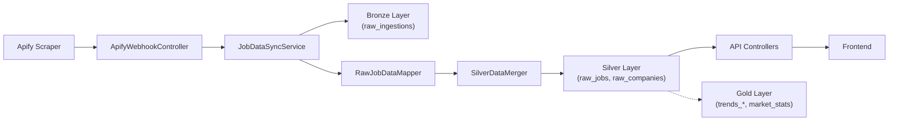

# Data Pipeline — Architecture, Review & Roadmap

This document captures the current state of the Tech Market data pipeline, recent refactoring work, test coverage analysis, and the future roadmap for Gold layer development.

---

## 1. Architecture Overview (Medallion Pattern)

| Layer | Table(s) | Source | Logic |
| :--- | :--- | :--- | :--- |
| **Bronze** | `raw_ingestions` | External (Apify) | Immutable raw JSON. Permanent audit trail. |
| **Silver** | `raw_jobs`, `raw_companies` | Bronze | Structured & cleansed. Merged with existing data on each sync. |
| **Gold** *(planned)* | `trends_*`, `market_stats` | Silver | Materialized monthly aggregates & company states. |

### Key Components

| Component | File | Responsibility |
|-----------|------|---------------|
| Orchestrator | `JobDataSyncService.kt` | Coordinates fetch → ingest → map → merge → persist |
| Transformer | `RawJobDataMapper.kt` | Filter → Group by Role → Group by Opening → Assemble |
| Parser | `RawJobDataParser.kt` | Location, tech, seniority, salary extraction |
| Merger | `SilverDataMerger.kt` | Merges new records with existing Silver data |
| ID Generator | `IdGenerator.kt` | Centralized slug/ID generation (company & job IDs) |

### Recent Refactoring (Completed)
- ✅ Centralized ID generation into `IdGenerator` utility
- ✅ Flattened `companyId` (removed `company/` prefix)
- ✅ Added dual-key job lookup (canonical slug + platform IDs)
- ✅ Implemented `SilverDataMerger` for non-destructive data updates
- ✅ Split mapping pipeline into testable stages (filter → group → assemble)

---

## 2. Test Coverage

| Test File | Tests | Covers | Gaps |
|-----------|-------|--------|------|
| `RawJobDataMapperTest` | 5 | Filter, grouping, lifecycle, assembly, full pipeline | No isolated `parseJobDetails` / `parseCompanyMetadata` tests |
| `SilverDataMergerTest` | 2 | Job merge, company merge | No edge cases (null salary, identical timestamps) |
| `JobDataSyncServiceTest` | 1 | Fetch-merge-delete-save cycle | No `reprocessHistoricalData` test |
| `CompanyMapperTest` | 1 | Canonical job ID mapping | No empty / null field tests |
| `AnalyticsMapperTest` | 1 | Landing page stats | Only stats, not tech or company mapping |
| `JobQueriesTest` | 2 | Similar jobs SQL generation | Missing `getDetailsSql`, `getByIdsSql` tests |
| `SqlSafetyTest` | 7 | SQL injection + backtick wrapping | ✅ Good coverage |
| `TechFormatterTest` | — | Tech name formatting | — |
| **`RawJobDataParserTest`** | **0** | — | **🔴 ZERO tests on the riskiest component** |
| **`IdGeneratorTest`** | **0** | — | **🔴 ZERO tests on the single source of truth for IDs** |

**Total: 8 test files, ~20 test cases. Target: ~52 tests.**

---

## 3. Improvements & Roadmap

### 🔴 Priority 1 — Critical Test Gaps

| Item | Why It Matters |
|------|---------------|
| **`RawJobDataParserTest`** (~12 tests) | All heuristic parsing (location, seniority, tech). A regex change silently breaks data quality. |
| **`IdGeneratorTest`** (~8 tests) | Single source of truth for all IDs. Must be bulletproof. |
| **`reprocessHistoricalData` test** | Used for production schema migrations; failure = data loss. |

### 🟡 Priority 2 — Code Quality

| Item | Detail |
|------|--------|
| Stale `JobRecord.jobId` comment | References old `job/{company}/...` format |
| `sanitize()` should be `private` | Currently `fun` (public) but only used internally |
| Non-transactional Delete-then-Insert | Crash between delete and save = data loss. Consider staging table swap. |
| Incremental reprocessing | `reprocessHistoricalData` wipes Silver tables; add date-range filtering as data grows. |

### 🟢 Priority 3 — Feature Enhancements

#### A. Job Expiry / Staleness Detection
- Add `status` field (`ACTIVE`, `LIKELY_CLOSED`, `EXPIRED`)
- Scheduled task marks jobs `LIKELY_CLOSED` if `lastSeenAt` > 30 days
- Frontend filters or visually differentiates stale listings

#### B. Data Quality Monitoring
- `/api/admin/health` endpoint returning: total jobs/companies, data quality score, last sync time, Bronze→Silver compression ratio

#### C. Salary Normalization
- Detect currency (NZD, AUD, EUR, USD)
- Normalize to annual figures (detect "per hour", "per month")
- Store currency alongside min/max

#### D. Multi-Source Support
- Add `source` discriminator to Bronze layer
- Make `RawJobDataMapper` source-aware for different platform layouts

#### E. Cross-Sync Deduplication
- Current dedup is within a single sync batch by `(company, country, title)`
- `SilverDataMerger` handles matching `jobId`s, but a fuzzy-match fallback would catch reopened roles with slightly different date parts

---

## 4. Gold Layer — Future Implementation

### Physical Tables (Monthly Metrics)
| Table | Content |
|-------|---------|
| `monthly_tech_trends` | Jobs per technology aggregated by month |
| `monthly_company_trends` | Job counts per company by month |
| `monthly_geo_trends` | Jobs per Country/City by month |
| `tech_adoption_by_company` | Which companies use which tech, based on active roles (< 6 months) |

### Job Lifecycle Metrics
- **`last_seen_at`** *(already implemented)*: Tracks how long a posting remains active
- **Metric**: "Average Job Open Time" as a market health indicator

### Storage Efficiency (Pruning)
- Prune roles from Silver layer (e.g., older than 6 months) **only after** aggregation into Gold tables
- Bronze is permanent → Silver/Gold can always be reconstructed

### Standardization
- Map seniority levels to a sealed set: `INTERN`, `JUNIOR`, `MID`, `SENIOR`, `LEAD`, `PRINCIPAL`, `EXECUTIVE`

### Implementation Steps
1. Create `GoldDataSyncService` for monthly trend materialization
2. Build BigQuery schemas for Gold tables
3. Add Silver layer pruning to the main sync pipeline
4. Standardize seniority mapping in `RawJobDataParser`
5. Add incremental reprocessing support (date-range filtering)
